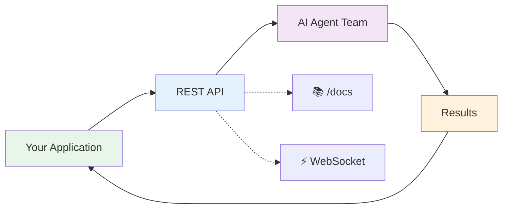

# Agentic Workflow System

> [!NOTE]
> **Archived.** This was a personal experiment (2025) in orchestrating multiple LLM agents for software-development tasks. It was never deployed as a hosted service and has no users. Coding agents such as Claude Code and GitHub Copilot's agent mode now cover this ground, so it is no longer maintained. The code and docs stay up as a learning record.

## What it is

A FastAPI service that coordinates specialized AI agents (planning, code generation, testing, review, CI/CD, requirements, program manager) through a REST + WebSocket API, with a visual workflow definition format.

- **REST API**: FastAPI, interactive OpenAPI docs at `/docs`
- **Multi-agent orchestration**: agents run alone or chained into workflows
- **Real-time updates**: WebSocket progress streaming
- **Auth**: JWT and API-key authentication

All examples below assume a local instance at `http://localhost:8000`.

---

## 🚀 Quick Start

### Option 1: Execute a Workflow via REST API

The simplest way to use Agentic Workflow:

```bash
# Execute a code review workflow
curl -X POST "http://localhost:8000/api/v1/workflows/execute" \
  -H "Authorization: Bearer YOUR_API_KEY" \
  -H "Content-Type: application/json" \
  -d '{
    "workflow": {
      "name": "Code Review",
      "steps": [
        {
          "agent": "code_review",
          "parameters": {
            "repository": "myorg/myrepo",
            "pr_number": 123
          }
        }
      ]
    }
  }'
```

**Response:**
```json
{
  "execution_id": "exec_20231111_142530",
  "status": "running",
  "websocket_url": "ws://localhost:8000/api/v1/ws/executions/exec_20231111_142530"
}
```

### Option 2: Use the Visual Workflow Builder

1. Open the visual builder at `http://localhost:8000/builder`
2. Drag and drop agents onto the canvas
3. Connect them with arrows
4. Click "Execute" and watch it run

### Option 3: Create Reusable Workflow Templates

```bash
# Create a workflow template
curl -X POST "http://localhost:8000/api/v1/workflows/visual/create" \
  -H "Authorization: Bearer YOUR_API_KEY" \
  -H "Content-Type: application/json" \
  -d '{
    "name": "Full Development Pipeline",
    "nodes": [
      {"id": "plan", "type": "agent", "data": {"agent_type": "planning"}},
      {"id": "code", "type": "agent", "data": {"agent_type": "code_generation"}},
      {"id": "test", "type": "agent", "data": {"agent_type": "testing"}}
    ],
    "edges": [
      {"source": "plan", "target": "code"},
      {"source": "code", "target": "test"}
    ]
  }'

# Execute the template with different parameters
curl -X POST "http://localhost:8000/api/v1/workflows/{workflow_id}/execute" \
  -H "Authorization: Bearer YOUR_API_KEY" \
  -d '{"parameters": {"task": "Implement user authentication"}}'
```

---

## 💡 What Can You Automate?

### Code Development Workflows

- **Code Review**: Automated PR review with AI insights
- **Code Generation**: Generate implementation from requirements
- **Testing**: Automatic test generation and execution
- **Documentation**: Generate and maintain documentation
- **Refactoring**: Automated code improvement suggestions

### CI/CD Pipelines

- **Build Automation**: Compile, test, and package
- **Deployment**: Automated deployment to staging/production
- **Quality Gates**: Automated quality checks before deployment
- **Rollback**: Intelligent rollback on failures

### Requirements & Planning

- **Requirement Analysis**: Break down complex requirements
- **Task Decomposition**: Split work into manageable tasks
- **Estimation**: AI-powered effort estimation
- **Architecture Planning**: Design system architecture

---

## 📖 API Documentation

### Interactive Documentation

With the server running locally:

- **Swagger UI**: [`http://localhost:8000/docs`](http://localhost:8000/docs)
  - Try API calls directly in your browser
  - See request/response schemas
  - Test authentication

- **ReDoc**: [`http://localhost:8000/redoc`](http://localhost:8000/redoc)
  - Beautiful, readable documentation
  - Detailed endpoint descriptions
  - Example requests and responses

- **OpenAPI Specification**: [`http://localhost:8000/openapi.json`](http://localhost:8000/openapi.json)
  - Machine-readable API spec
  - Import into Postman, Insomnia, or any API client
  - Generate client libraries in any language

### Key API Endpoints

| Endpoint | Method | Description |
|----------|--------|-------------|
| `/api/v1/workflows` | GET | List all workflows |
| `/api/v1/workflows/visual/create` | POST | Create visual workflow |
| `/api/v1/workflows/{id}` | GET | Get workflow details |
| `/api/v1/workflows/{id}/execute` | POST | Execute a workflow |
| `/api/v1/workflows/executions/{id}` | GET | Check execution status |
| `/api/v1/ws/executions/{id}` | WebSocket | Real-time progress updates |
| `/api/v1/agents` | GET | List available agents |
| `/api/v1/health` | GET | System health check |

### Example: Full Workflow Lifecycle

```bash
# 1. Create a workflow
WORKFLOW_ID=$(curl -X POST "http://localhost:8000/api/v1/workflows/visual/create" \
  -H "Authorization: Bearer YOUR_API_KEY" \
  -H "Content-Type: application/json" \
  -d @workflow.json | jq -r '.workflow_id')

# 2. Execute it
EXEC_ID=$(curl -X POST "http://localhost:8000/api/v1/workflows/${WORKFLOW_ID}/execute" \
  -H "Authorization: Bearer YOUR_API_KEY" \
  -d '{"parameters": {}}' | jq -r '.execution_id')

# 3. Check status
curl "http://localhost:8000/api/v1/workflows/executions/${EXEC_ID}" \
  -H "Authorization: Bearer YOUR_API_KEY"

# 4. Get results
curl "http://localhost:8000/api/v1/workflows/executions/${EXEC_ID}" \
  -H "Authorization: Bearer YOUR_API_KEY" | jq '.result'
```

---

## 🔐 Authentication

### API Keys (Recommended for Services)

```bash
# Include in Authorization header
curl -H "Authorization: Bearer YOUR_API_KEY" \
  http://localhost:8000/api/v1/workflows
```

**Get your API key:**
- Dashboard: `http://localhost:8000/settings/api-keys`
- API: `POST /api/v1/auth/api-keys/create`

### JWT Tokens (For User Sessions)

```bash
# Login to get token
TOKEN=$(curl -X POST "http://localhost:8000/api/v1/auth/login" \
  -H "Content-Type: application/x-www-form-urlencoded" \
  -d "username=your_user&password=your_pass" | jq -r '.access_token')

# Use token
curl -H "Authorization: Bearer $TOKEN" \
  http://localhost:8000/api/v1/workflows
```

---

## 🤖 Available AI Agents

Specialized agents included:

| Agent | Purpose | Key Capabilities |
|-------|---------|------------------|
| **Planning Agent** | Strategic planning | Task decomposition, estimation, architecture |
| **Code Generation** | Write code | Generate implementations from requirements |
| **Testing Agent** | Quality assurance | Generate and run tests, coverage analysis |
| **Code Review** | Code quality | Automated PR review, best practices |
| **CI/CD Agent** | Deployment | Build, test, deploy pipelines |
| **Requirement Engineering** | Requirements analysis | Extract, analyze, validate requirements |
| **Program Manager** | Orchestration | Coordinate multi-agent workflows |

Each agent can work independently or collaborate with others for complex tasks.

---

## 📊 Real-Time Monitoring

### WebSocket Updates

Get real-time progress updates during workflow execution:

```javascript
// JavaScript example
const ws = new WebSocket('ws://localhost:8000/api/v1/ws/executions/exec_123');

ws.onmessage = (event) => {
  const update = JSON.parse(event.data);
  console.log(`Progress: ${update.progress}%`);
  console.log(`Current step: ${update.current_step}`);
  console.log(`Status: ${update.status}`);
};
```

```python
# Python example
import asyncio
import websockets

async def monitor_execution(execution_id):
    uri = f"ws://localhost:8000/api/v1/ws/executions/{execution_id}"
    async with websockets.connect(uri) as websocket:
        async for message in websocket:
            update = json.loads(message)
            print(f"Progress: {update['progress']}%")
            print(f"Status: {update['status']}")
```

### Execution History

```bash
# List all executions for a workflow
GET /api/v1/workflows/{workflow_id}/executions

# Get detailed execution information
GET /api/v1/workflows/executions/{execution_id}
```

---

## 🏗️ Architecture Overview

### High-level flow


```mermaid
graph LR
    YOU[Your Application] --> API[REST API]
    API --> AGENTS[AI Agent Team]
    AGENTS --> RESULTS[Results]
    RESULTS --> YOU
    
    API -.-> DOCS[📚 /docs]
    API -.-> REALTIME[⚡ WebSocket]
    
    style YOU fill:#e8f5e9
    style API fill:#e3f2fd
    style AGENTS fill:#f3e5f5
    style RESULTS fill:#fff3e0
```

### System Components

- **REST API Gateway**: FastAPI-powered, 35+ endpoints
- **AI Agent Team**: 7 specialized agents powered by GPT-4/5
- **Visual Builder**: No-code workflow creation
- **Real-Time Engine**: WebSocket-based progress updates

[See detailed architecture diagrams →](docs/architecture/ARCHITECTURE_DIAGRAMS.md)

---

## 📚 Documentation & Resources

### For API Consumers

- 🚀 [**Getting Started Guide**](docs/CUSTOMER_GETTING_STARTED.md) - Start here!
- 📖 [**API Reference**](http://localhost:8000/docs) - Interactive Swagger docs
- 🎨 [**Visual Builder Guide**](docs/VISUAL_BUILDER_GUIDE.md) - No-code workflows
- 🔧 [**Integration Examples**](docs/INTEGRATION_EXAMPLES.md) - Sample code
- ❓ [**FAQ**](docs/FAQ.md) - Common questions

### For Developers & Contributors

- 🏗️ [**Architecture**](docs/architecture/ARCHITECTURE_DIAGRAMS.md) - System design
- 💻 [**Developer Guide**](docs/DEVELOPER_GUIDE.md) - Setup and contributing
- 📝 [**API Development**](docs/API_DEVELOPMENT.md) - Extend the API
- 🧪 [**Testing Guide**](docs/TESTING_GUIDE.md) - Test your integrations
- 📊 [**Conventions**](CONVENTIONS.md) - Development standards

---

## 🚦 Health Check

Check the health of a local instance:

```bash
curl http://localhost:8000/api/v1/health
```

**Response:**
```json
{
  "status": "healthy",
  "version": "0.6.0",
  "uptime_seconds": 1234567,
  "components": {
    "api": "healthy",
    "database": "healthy",
    "ai_agents": "healthy",
    "cache": "healthy"
  }
}
```

---

## 📄 License

No license file is included, so default copyright applies.

---

## 🤝 Contributing

The project is archived and not accepting contributions. The [Developer Guide](docs/DEVELOPER_GUIDE.md) still documents:

- Setting up development environment
- Code style and conventions
- Testing requirements
- Pull request process

