# Agentic Workflow System

> **AI-Powered Automation for Software Development**  
> Automate complex development tasks with intelligent AI agents working together

[](CHANGELOG.md)
[](https://your-instance.com/docs)
[]()

---

## 🎯 What is Agentic Workflow?

**Agentic Workflow** is a production-ready AI automation platform that uses multiple intelligent agents to handle complex software development tasks. Whether you're reviewing code, generating tests, or orchestrating entire development pipelines, Agentic Workflow provides a simple REST API to get the job done.

### Why Choose Agentic Workflow?

- 🚀 **Simple REST API**: Single endpoint to execute complex workflows
- 🎨 **Visual Workflow Builder**: Create workflows without writing code
- 🤖 **Multi-Agent Intelligence**: AI agents collaborate like a real team
- ⚡ **Real-Time Updates**: WebSocket support for live progress tracking
- 📊 **Production Ready**: Built on FastAPI, battle-tested and scalable
- 🔐 **Enterprise Security**: OAuth2, JWT, API keys, tenant isolation
- 📖 **Self-Documenting**: Interactive OpenAPI/Swagger documentation

---

## 🚀 Quick Start (3 Minutes)

### Option 1: Execute a Workflow via REST API

The simplest way to use Agentic Workflow:

```bash
# Execute a code review workflow
curl -X POST "https://your-instance.com/api/v1/workflows/execute" \
  -H "Authorization: Bearer YOUR_API_KEY" \
  -H "Content-Type: application/json" \
  -d '{
    "workflow": {
      "name": "Code Review",
      "steps": [
        {
          "agent": "code_review",
          "parameters": {
            "repository": "myorg/myrepo",
            "pr_number": 123
          }
        }
      ]
    }
  }'
```

**Response:**
```json
{
  "execution_id": "exec_20231111_142530",
  "status": "running",
  "websocket_url": "wss://your-instance.com/api/v1/ws/executions/exec_20231111_142530"
}
```

### Option 2: Use the Visual Workflow Builder

1. Open the visual builder at `https://your-instance.com/builder`
2. Drag and drop agents onto the canvas
3. Connect them with arrows
4. Click "Execute" and watch it run

### Option 3: Create Reusable Workflow Templates

```bash
# Create a workflow template
curl -X POST "https://your-instance.com/api/v1/workflows/visual/create" \
  -H "Authorization: Bearer YOUR_API_KEY" \
  -H "Content-Type: application/json" \
  -d '{
    "name": "Full Development Pipeline",
    "nodes": [
      {"id": "plan", "type": "agent", "data": {"agent_type": "planning"}},
      {"id": "code", "type": "agent", "data": {"agent_type": "code_generation"}},
      {"id": "test", "type": "agent", "data": {"agent_type": "testing"}}
    ],
    "edges": [
      {"source": "plan", "target": "code"},
      {"source": "code", "target": "test"}
    ]
  }'

# Execute the template with different parameters
curl -X POST "https://your-instance.com/api/v1/workflows/{workflow_id}/execute" \
  -H "Authorization: Bearer YOUR_API_KEY" \
  -d '{"parameters": {"task": "Implement user authentication"}}'
```

---

## 💡 What Can You Automate?

### Code Development Workflows

- **Code Review**: Automated PR review with AI insights
- **Code Generation**: Generate implementation from requirements
- **Testing**: Automatic test generation and execution
- **Documentation**: Generate and maintain documentation
- **Refactoring**: Automated code improvement suggestions

### CI/CD Pipelines

- **Build Automation**: Compile, test, and package
- **Deployment**: Automated deployment to staging/production
- **Quality Gates**: Automated quality checks before deployment
- **Rollback**: Intelligent rollback on failures

### Requirements & Planning

- **Requirement Analysis**: Break down complex requirements
- **Task Decomposition**: Split work into manageable tasks
- **Estimation**: AI-powered effort estimation
- **Architecture Planning**: Design system architecture

---

## 📖 API Documentation

### Interactive Documentation

Access our comprehensive, interactive API documentation:

- **Swagger UI**: [`https://your-instance.com/docs`](https://your-instance.com/docs)
  - Try API calls directly in your browser
  - See request/response schemas
  - Test authentication

- **ReDoc**: [`https://your-instance.com/redoc`](https://your-instance.com/redoc)
  - Beautiful, readable documentation
  - Detailed endpoint descriptions
  - Example requests and responses

- **OpenAPI Specification**: [`https://your-instance.com/openapi.json`](https://your-instance.com/openapi.json)
  - Machine-readable API spec
  - Import into Postman, Insomnia, or any API client
  - Generate client libraries in any language

### Key API Endpoints

| Endpoint | Method | Description |
|----------|--------|-------------|
| `/api/v1/workflows` | GET | List all workflows |
| `/api/v1/workflows/visual/create` | POST | Create visual workflow |
| `/api/v1/workflows/{id}` | GET | Get workflow details |
| `/api/v1/workflows/{id}/execute` | POST | Execute a workflow |
| `/api/v1/workflows/executions/{id}` | GET | Check execution status |
| `/api/v1/ws/executions/{id}` | WebSocket | Real-time progress updates |
| `/api/v1/agents` | GET | List available agents |
| `/api/v1/health` | GET | System health check |

### Example: Full Workflow Lifecycle

```bash
# 1. Create a workflow
WORKFLOW_ID=$(curl -X POST "https://your-instance.com/api/v1/workflows/visual/create" \
  -H "Authorization: Bearer YOUR_API_KEY" \
  -H "Content-Type: application/json" \
  -d @workflow.json | jq -r '.workflow_id')

# 2. Execute it
EXEC_ID=$(curl -X POST "https://your-instance.com/api/v1/workflows/${WORKFLOW_ID}/execute" \
  -H "Authorization: Bearer YOUR_API_KEY" \
  -d '{"parameters": {}}' | jq -r '.execution_id')

# 3. Check status
curl "https://your-instance.com/api/v1/workflows/executions/${EXEC_ID}" \
  -H "Authorization: Bearer YOUR_API_KEY"

# 4. Get results
curl "https://your-instance.com/api/v1/workflows/executions/${EXEC_ID}" \
  -H "Authorization: Bearer YOUR_API_KEY" | jq '.result'
```

---

## 🔐 Authentication

### API Keys (Recommended for Services)

```bash
# Include in Authorization header
curl -H "Authorization: Bearer YOUR_API_KEY" \
  https://your-instance.com/api/v1/workflows
```

**Get your API key:**
- Dashboard: `https://your-instance.com/settings/api-keys`
- API: `POST /api/v1/auth/api-keys/create`

### JWT Tokens (For User Sessions)

```bash
# Login to get token
TOKEN=$(curl -X POST "https://your-instance.com/api/v1/auth/login" \
  -H "Content-Type: application/x-www-form-urlencoded" \
  -d "username=your_user&password=your_pass" | jq -r '.access_token')

# Use token
curl -H "Authorization: Bearer $TOKEN" \
  https://your-instance.com/api/v1/workflows
```

---

## 🤖 Available AI Agents

Our platform includes specialized AI agents for different tasks:

| Agent | Purpose | Key Capabilities |
|-------|---------|------------------|
| **Planning Agent** | Strategic planning | Task decomposition, estimation, architecture |
| **Code Generation** | Write code | Generate implementations from requirements |
| **Testing Agent** | Quality assurance | Generate and run tests, coverage analysis |
| **Code Review** | Code quality | Automated PR review, best practices |
| **CI/CD Agent** | Deployment | Build, test, deploy pipelines |
| **Requirement Engineering** | Requirements analysis | Extract, analyze, validate requirements |
| **Program Manager** | Orchestration | Coordinate multi-agent workflows |

Each agent can work independently or collaborate with others for complex tasks.

---

## 📊 Real-Time Monitoring

### WebSocket Updates

Get real-time progress updates during workflow execution:

```javascript
// JavaScript example
const ws = new WebSocket('wss://your-instance.com/api/v1/ws/executions/exec_123');

ws.onmessage = (event) => {
  const update = JSON.parse(event.data);
  console.log(`Progress: ${update.progress}%`);
  console.log(`Current step: ${update.current_step}`);
  console.log(`Status: ${update.status}`);
};
```

```python
# Python example
import asyncio
import websockets

async def monitor_execution(execution_id):
    uri = f"wss://your-instance.com/api/v1/ws/executions/{execution_id}"
    async with websockets.connect(uri) as websocket:
        async for message in websocket:
            update = json.loads(message)
            print(f"Progress: {update['progress']}%")
            print(f"Status: {update['status']}")
```

### Execution History

```bash
# List all executions for a workflow
GET /api/v1/workflows/{workflow_id}/executions

# Get detailed execution information
GET /api/v1/workflows/executions/{execution_id}
```

---

## 🏗️ Architecture Overview

### Customer Journey (40,000 Feet View)

```mermaid
graph LR
    YOU[Your Application] --> API[REST API]
    API --> AGENTS[AI Agent Team]
    AGENTS --> RESULTS[Results]
    RESULTS --> YOU
    
    API -.-> DOCS[📚 /docs]
    API -.-> REALTIME[⚡ WebSocket]
    
    style YOU fill:#e8f5e9
    style API fill:#e3f2fd
    style AGENTS fill:#f3e5f5
    style RESULTS fill:#fff3e0
```



### System Components

- **REST API Gateway**: FastAPI-powered, 35+ endpoints
- **AI Agent Team**: 7 specialized agents powered by GPT-4/5
- **Visual Builder**: No-code workflow creation
- **Real-Time Engine**: WebSocket-based progress updates
- **Enterprise Features**: Multi-tenancy, billing, analytics

[See detailed architecture diagrams →](docs/architecture/ARCHITECTURE_DIAGRAMS.md)

---

## 💼 Use Cases

### Startup: Accelerate Development

```bash
# Generate MVP features
POST /api/v1/workflows/execute
{
  "workflow": {
    "steps": [
      {"agent": "planning", "parameters": {"objective": "User authentication"}},
      {"agent": "code_generation", "parameters": {"framework": "FastAPI"}},
      {"agent": "testing", "parameters": {"coverage": 80}}
    ]
  }
}
```

### Enterprise: Automated Code Review

```bash
# Review all PRs automatically
POST /api/v1/workflows/{code_review_template}/execute
{
  "parameters": {
    "repository": "enterprise/main-app",
    "pr_number": 1234,
    "compliance_checks": true
  }
}
```

### Agency: Client Project Management

```bash
# Generate requirements, code, and tests
POST /api/v1/workflows/{full_pipeline}/execute
{
  "parameters": {
    "client": "acme_corp",
    "project": "ecommerce_platform"
  }
}
```

---

## 📈 Pricing Tiers

| Feature | Free | Professional | Enterprise |
|---------|------|--------------|------------|
| Workflows/month | 100 | 1,000 | Unlimited |
| API calls/day | 1,000 | 10,000 | Unlimited |
| Visual builder | ✓ | ✓ | ✓ |
| Real-time monitoring | ✓ | ✓ | ✓ |
| WebSocket support | ✓ | ✓ | ✓ |
| Priority support | - | ✓ | ✓ |
| Custom agents | - | Limited | ✓ |
| Multi-tenancy | - | - | ✓ |
| On-premise | - | - | ✓ |
| SLA guarantee | - | - | 99.9% |

---

## 📚 Documentation & Resources

### For API Consumers

- 🚀 [**Getting Started Guide**](docs/CUSTOMER_GETTING_STARTED.md) - Start here!
- 📖 [**API Reference**](https://your-instance.com/docs) - Interactive Swagger docs
- 🎨 [**Visual Builder Guide**](docs/VISUAL_BUILDER_GUIDE.md) - No-code workflows
- 🔧 [**Integration Examples**](docs/INTEGRATION_EXAMPLES.md) - Sample code
- ❓ [**FAQ**](docs/FAQ.md) - Common questions

### For Developers & Contributors

- 🏗️ [**Architecture**](docs/architecture/ARCHITECTURE_DIAGRAMS.md) - System design
- 💻 [**Developer Guide**](docs/DEVELOPER_GUIDE.md) - Setup and contributing
- 📝 [**API Development**](docs/API_DEVELOPMENT.md) - Extend the API
- 🧪 [**Testing Guide**](docs/TESTING_GUIDE.md) - Test your integrations
- 📊 [**Conventions**](CONVENTIONS.md) - Development standards

### Support

- 💬 [GitHub Discussions](https://github.com/yourusername/agentic-workflow/discussions)
- 🐛 [Report Issues](https://github.com/yourusername/agentic-workflow/issues)
- 📧 Email: support@agentic-workflow.com
- 💼 Slack: [Join our community](https://slack.agentic-workflow.com)

---

## 🚦 System Status

Check the health of your instance:

```bash
curl https://your-instance.com/api/v1/health
```

**Response:**
```json
{
  "status": "healthy",
  "version": "0.6.0",
  "uptime_seconds": 1234567,
  "components": {
    "api": "healthy",
    "database": "healthy",
    "ai_agents": "healthy",
    "cache": "healthy"
  }
}
```

---

## 🔒 Security & Compliance

- 🔐 **Authentication**: OAuth2, JWT, API keys
- 👥 **Multi-Tenancy**: Complete tenant isolation
- 📊 **Audit Logging**: Full activity tracking
- 🛡️ **Data Privacy**: GDPR compliant
- 🔒 **Encryption**: TLS 1.3, data at rest encryption
- 🔄 **Rate Limiting**: Prevent abuse
- 🚨 **Security Scanning**: Automated vulnerability checks

---

## 🌟 Client Success Stories

> "Reduced code review time by 70% and caught issues our team missed."  
> — **Tech Lead, Fortune 500 Company**

> "The visual workflow builder let our PM create automation without engineering help."  
> — **CTO, Growing Startup**

> "Handles 1000+ workflows daily. Rock solid reliability."  
> — **DevOps Lead, Enterprise SaaS**

---

## 🚀 Getting Started Checklist

- [ ] **Get Access**: Sign up or request API key
- [ ] **Read Docs**: Visit [Getting Started Guide](docs/CUSTOMER_GETTING_STARTED.md)
- [ ] **Try API**: Use Swagger UI at `/docs`
- [ ] **Create Workflow**: Start with visual builder
- [ ] **Integrate**: Add to your application
- [ ] **Scale**: Upgrade to Professional or Enterprise

---

## 📄 License

This project is licensed under the MIT License - see the [LICENSE](LICENSE) file for details.

---

## 🤝 Contributing

We welcome contributions! See our [Developer Guide](docs/DEVELOPER_GUIDE.md) for:

- Setting up development environment
- Code style and conventions
- Testing requirements
- Pull request process

---

## 📞 Contact & Support

- **Website**: https://agentic-workflow.com
- **Documentation**: https://docs.agentic-workflow.com
- **Email**: support@agentic-workflow.com
- **Sales**: sales@agentic-workflow.com
- **Twitter**: [@AgenticWorkflow](https://twitter.com/AgenticWorkflow)

---

**🎯 Ready to automate your development workflow?**

[Get Started →](docs/CUSTOMER_GETTING_STARTED.md) | [API Docs →](https://your-instance.com/docs) | [Join Community →](https://github.com/yourusername/agentic-workflow/discussions)

---

*Version 0.6.0 | Last Updated: November 11, 2025*  
*Built with ❤️ by the Agentic Workflow Team*
