# Architecture Diagrams - Agentic Workflow System
## Comprehensive System Architecture Visualization

**Document Version:** 2.0  
**Date:** November 11, 2025  
**Status:** Current

---

## 0. Customer-Facing Views (New)

### 0.1 Customer Workflow Journey (40,000 Feet View)

**For Business Users and Product Managers**

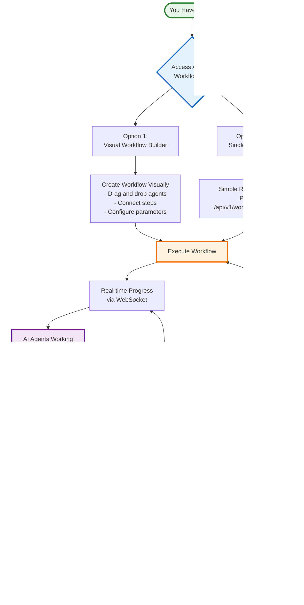

**What This Means for You:**
- 🎯 **Simple Integration**: Just one REST API endpoint to start automation
- 🎨 **Visual or Code**: Choose visual builder or direct API calls
- ⚡ **Real-time Updates**: Watch your workflow execute in real-time
- 🤖 **AI-Powered**: Multiple AI agents work together on your tasks
- 📊 **Full Visibility**: Track progress, get results, handle errors

### 0.2 System Components (Customer View)

**What's Under the Hood**

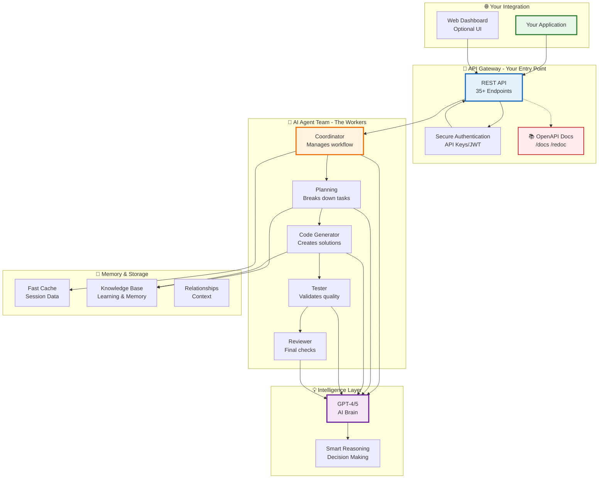

**Key Features for You:**
- 🔐 **Enterprise Security**: OAuth2, JWT tokens, API keys
- 📖 **Self-Documenting**: Interactive OpenAPI/Swagger docs
- 🚀 **Production Ready**: Built on FastAPI, battle-tested
- 🧠 **Latest AI**: GPT-4/GPT-5 powered intelligence
- 📈 **Scalable**: Designed for high-volume production use

### 0.3 Visual Workflow Builder Flow

**Create Workflows Without Code**

```mermaid
graph LR
    subgraph "🎨 Visual Builder"
        START[1. Open Builder] --> DRAG[2. Drag Agents<br/>onto Canvas]
        DRAG --> CONNECT[3. Connect Steps<br/>with Arrows]
        CONNECT --> CONFIG[4. Configure<br/>Each Agent]
        CONFIG --> SAVE[5. Save Workflow]
    end
    
    subgraph "🚀 Execution"
        SAVE --> EXEC[6. Click Execute]
        EXEC --> WATCH[7. Watch Real-time<br/>Progress]
        WATCH --> RESULTS[8. Get Results]
    end
    
    subgraph "📊 Management"
        RESULTS --> VIEW[View History]
        VIEW --> REUSE[Reuse & Share]
        REUSE --> SCHEDULE[Schedule Runs]
    end
    
    style START fill:#e8f5e9,stroke:#2e7d32,stroke-width:2px
    style EXEC fill:#fff3e0,stroke:#ef6c00,stroke-width:3px
    style RESULTS fill:#e3f2fd,stroke:#1565c0,stroke-width:2px
```

**Visual Builder Benefits:**
- 🎯 **No Coding Required**: Point, click, configure
- 🔄 **Reusable Templates**: Save and share workflows
- 👥 **Team Collaboration**: Share workflows across teams
- 📅 **Scheduling**: Run workflows on a schedule
- 📈 **Version Control**: Track workflow changes

---

## 1. 20,000 Feet Architecture Diagram

### High-Level System Overview

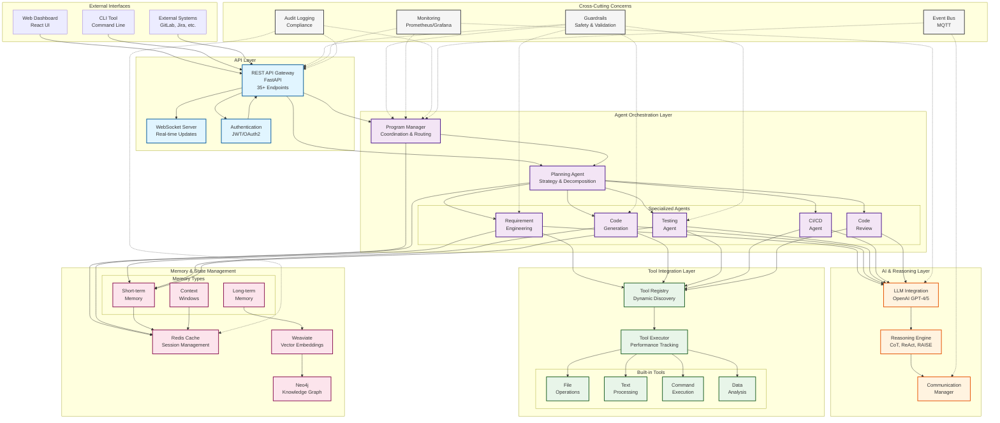

**Key Components:**
- **Blue (API Layer)**: External interfaces and API gateway
- **Purple (Agent Layer)**: Intelligent agents and orchestration
- **Orange (AI Layer)**: LLM integration and reasoning
- **Green (Tool Layer)**: Tool integration and execution
- **Pink (Memory Layer)**: Multi-store memory management
- **Gray (Cross-cutting)**: Monitoring, security, events

---

## 2. Module/Component Diagrams

### 2.1 Core Module Structure

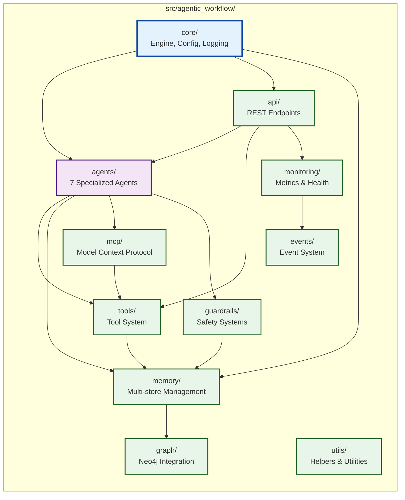

### 2.2 Agent Architecture

```mermaid
graph TB
    subgraph "Base Agent Framework"
        BASE[Agent Base Class<br/>src/agents/base.py]
        TASK[AgentTask Model<br/>Input Specification]
        RESULT[AgentResult Model<br/>Output Specification]
    end
    
    subgraph "Specialized Agents (7 Total)"
        PLAN[Planning Agent<br/>837 lines<br/>Strategic Planning]
        PM[Program Manager<br/>1,949 lines<br/>Coordination]
        REQ[Requirement Engineering<br/>665 lines<br/>Requirements Analysis]
        CODE[Code Generation<br/>737 lines<br/>AI-Powered Coding]
        TEST[Testing Agent<br/>1,096 lines<br/>Test Generation]
        CICD[CI/CD Agent<br/>891 lines<br/>Pipeline Management]
        REVIEW[Review Agent<br/>1,022 lines<br/>Code Review]
    end
    
    subgraph "Agent Capabilities"
        EXEC[Execute Method<br/>Core Logic]
        INIT[Initialize Method<br/>Setup Resources]
        HEALTH[Health Check<br/>Status Monitoring]
        PLAN_METHOD[Plan Method<br/>Task Decomposition]
        CAPS[Get Capabilities<br/>Feature Discovery]
    end
    
    subgraph "Agent Support Systems"
        MEMORY_INT[Memory Integration<br/>State Management]
        LLM_INT[LLM Integration<br/>AI Capabilities]
        TOOL_INT[Tool Integration<br/>External Actions]
        GUARD_INT[Guardrails Integration<br/>Safety Checks]
    end
    
    BASE --> PLAN
    BASE --> PM
    BASE --> REQ
    BASE --> CODE
    BASE --> TEST
    BASE --> CICD
    BASE --> REVIEW
    
    BASE --> EXEC
    BASE --> INIT
    BASE --> HEALTH
    BASE --> PLAN_METHOD
    BASE --> CAPS
    
    PLAN --> MEMORY_INT
    PM --> MEMORY_INT
    REQ --> MEMORY_INT
    CODE --> LLM_INT
    TEST --> LLM_INT
    CICD --> TOOL_INT
    REVIEW --> LLM_INT
    
    EXEC --> GUARD_INT
    
    classDef baseClass fill:#fff3e0,stroke:#e65100,stroke-width:3px
    classDef agentClass fill:#f3e5f5,stroke:#4a148c,stroke-width:2px
    classDef methodClass fill:#e8f5e9,stroke:#1b5e20,stroke-width:2px
    classDef supportClass fill:#e1f5ff,stroke:#01579b,stroke-width:2px
    
    class BASE,TASK,RESULT baseClass
    class PLAN,PM,REQ,CODE,TEST,CICD,REVIEW agentClass
    class EXEC,INIT,HEALTH,PLAN_METHOD,CAPS methodClass
    class MEMORY_INT,LLM_INT,TOOL_INT,GUARD_INT supportClass
```

### 2.3 Memory Architecture

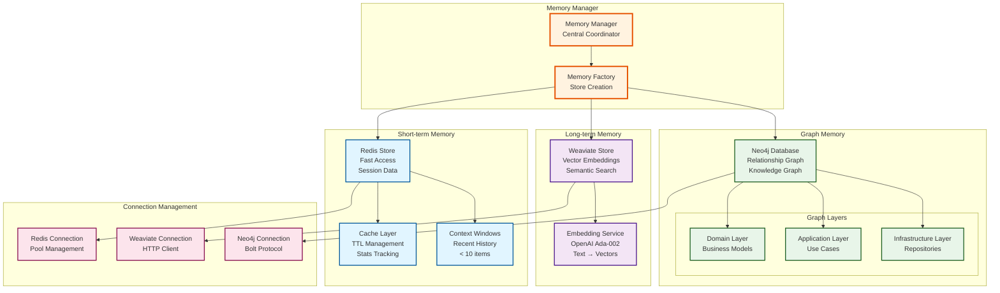

### 2.4 Tool Integration Architecture

```mermaid
graph TB
    subgraph "Tool Manager"
        MANAGER[Tool Manager<br/>Central Coordinator]
        REGISTRY[Tool Registry<br/>Discovery & Metadata]
    end
    
    subgraph "Tool Discovery"
        DISCOVER[Dynamic Discovery<br/>Module Scanning]
        METADATA[Metadata Extraction<br/>Tool Capabilities]
        RECOMMEND[Recommendation Engine<br/>Task Matching]
    end
    
    subgraph "Built-in Tools (4 Categories)"
        subgraph "File Operations"
            FILE_READ[File Read]
            FILE_WRITE[File Write]
            FILE_LIST[Directory List]
        end
        
        subgraph "Text Processing"
            TEXT_ANALYZE[Text Analysis]
            TEXT_TRANSFORM[Text Transform]
            TEXT_VALIDATE[Text Validation]
        end
        
        subgraph "Command Execution"
            CMD_EXEC[Command Execute]
            CMD_VALIDATE[Command Validate]
        end
        
        subgraph "Data Analysis"
            DATA_STATS[Statistics]
            DATA_TRANSFORM[Transform]
            DATA_VALIDATE[Validate]
        end
    end
    
    subgraph "Tool Execution"
        EXECUTOR[Tool Executor<br/>Safe Execution]
        MONITOR[Performance Monitor<br/>Metrics Tracking]
        GUARD[Guardrails<br/>Safety Checks]
    end
    
    subgraph "Custom Tools"
        CUSTOM[Custom Tool Interface<br/>Extension Point]
        PLUGIN[Plugin System<br/>Dynamic Loading]
    end
    
    MANAGER --> REGISTRY
    MANAGER --> DISCOVER
    
    DISCOVER --> METADATA
    REGISTRY --> RECOMMEND
    
    REGISTRY --> FILE_READ
    REGISTRY --> FILE_WRITE
    REGISTRY --> FILE_LIST
    REGISTRY --> TEXT_ANALYZE
    REGISTRY --> TEXT_TRANSFORM
    REGISTRY --> TEXT_VALIDATE
    REGISTRY --> CMD_EXEC
    REGISTRY --> CMD_VALIDATE
    REGISTRY --> DATA_STATS
    REGISTRY --> DATA_TRANSFORM
    REGISTRY --> DATA_VALIDATE
    
    MANAGER --> EXECUTOR
    EXECUTOR --> MONITOR
    EXECUTOR --> GUARD
    
    REGISTRY --> CUSTOM
    CUSTOM --> PLUGIN
    
    classDef managerClass fill:#fff3e0,stroke:#e65100,stroke-width:3px
    classDef discoveryClass fill:#e1f5ff,stroke:#01579b,stroke-width:2px
    classDef toolClass fill:#e8f5e9,stroke:#1b5e20,stroke-width:2px
    classDef executionClass fill:#f3e5f5,stroke:#4a148c,stroke-width:2px
    classDef customClass fill:#fce4ec,stroke:#880e4f,stroke-width:2px
    
    class MANAGER,REGISTRY managerClass
    class DISCOVER,METADATA,RECOMMEND discoveryClass
    class FILE_READ,FILE_WRITE,FILE_LIST,TEXT_ANALYZE,TEXT_TRANSFORM,TEXT_VALIDATE,CMD_EXEC,CMD_VALIDATE,DATA_STATS,DATA_TRANSFORM,DATA_VALIDATE toolClass
    class EXECUTOR,MONITOR,GUARD executionClass
    class CUSTOM,PLUGIN customClass
```

---

## 3. Sequence Diagrams

### 3.1 Workflow Execution Flow

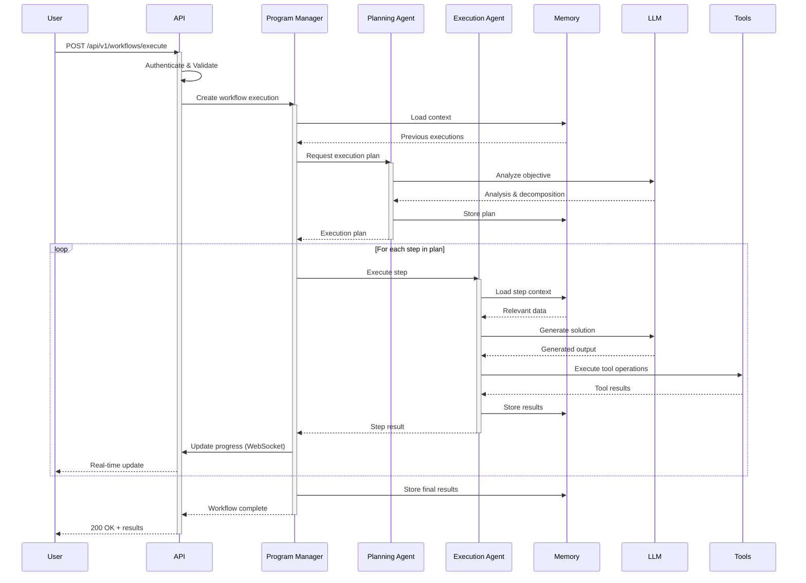

### 3.2 Agent Reasoning Flow (CoT, ReAct, RAISE)

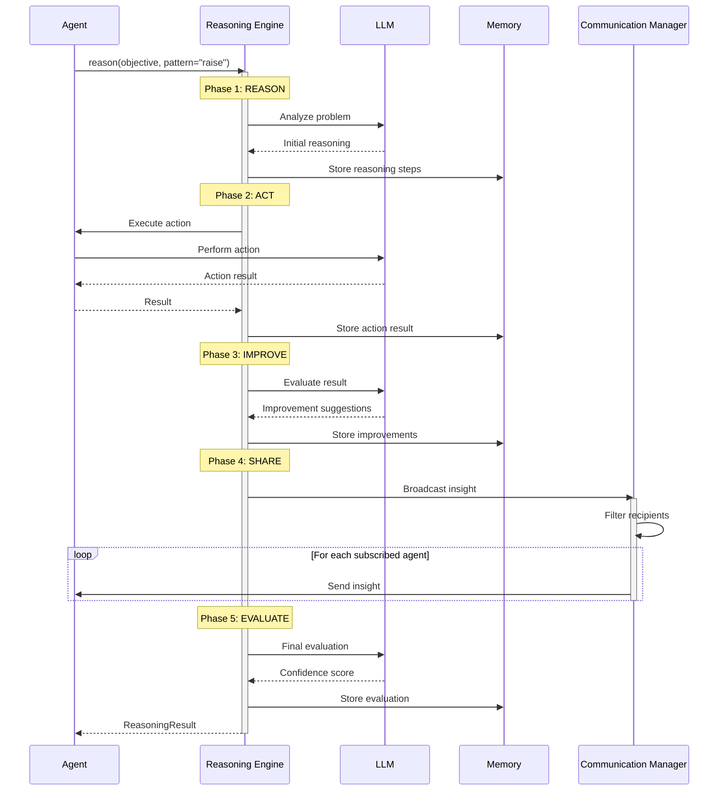

### 3.3 Tool Discovery and Execution

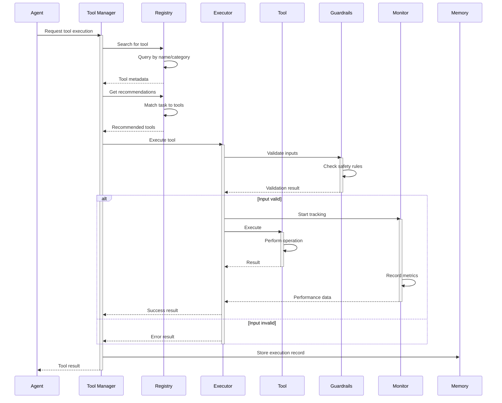

### 3.4 Memory Store Operation

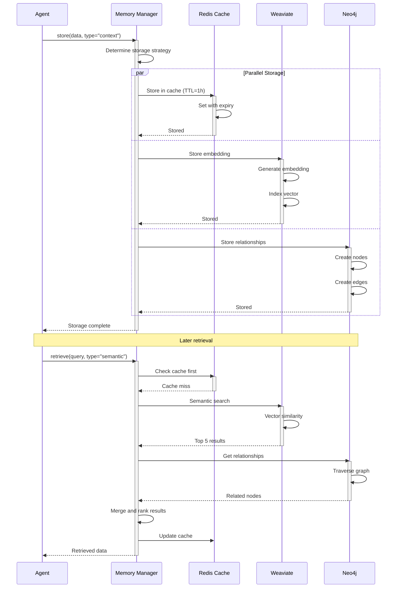

### 3.5 API Request Handling

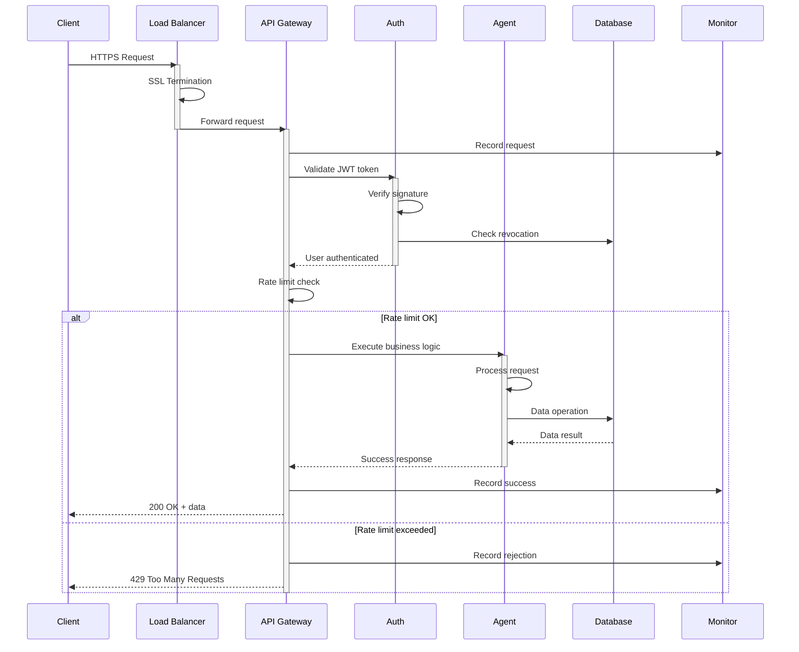

---

## 4. Data Flow Diagrams

### 4.1 Agent Execution Data Flow

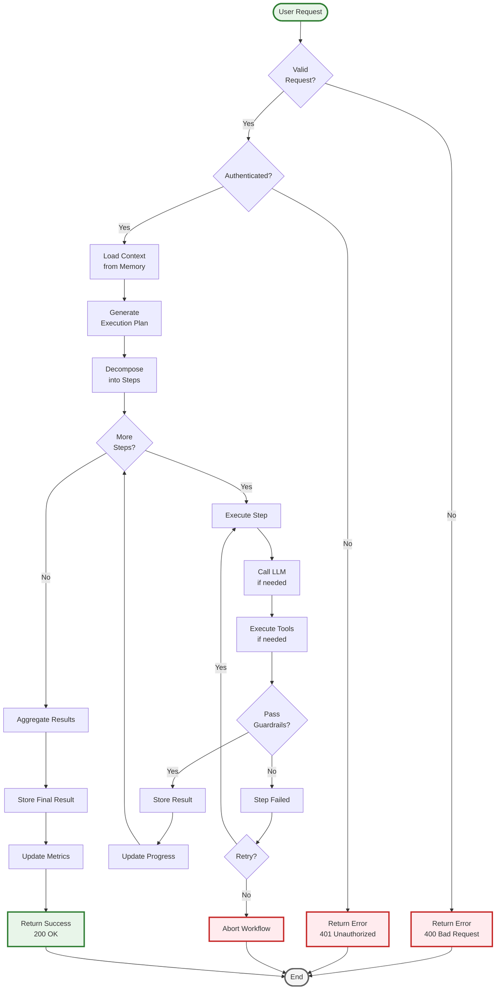

### 4.2 Memory Storage Data Flow

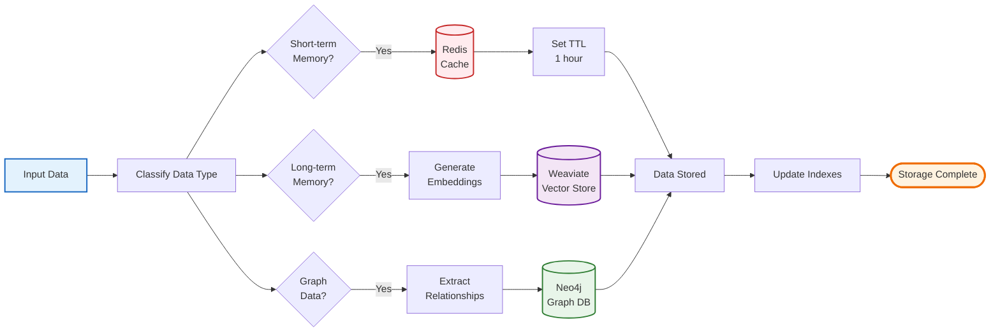

---

## 5. Deployment Architecture

### 5.1 Production Deployment

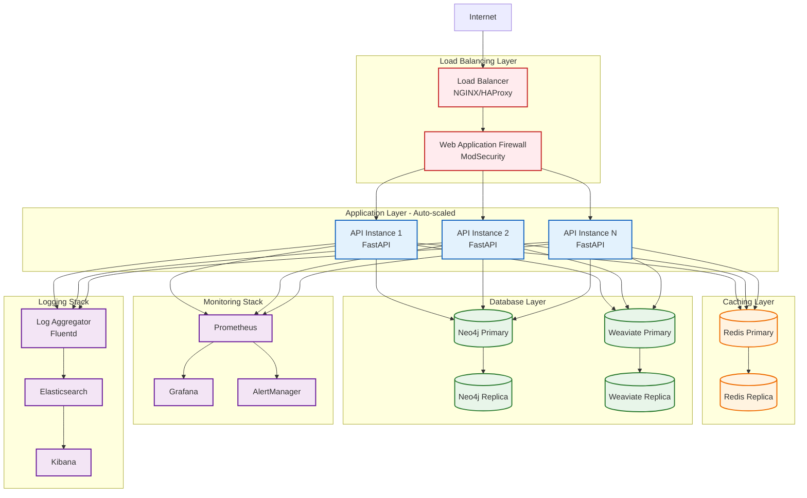

---

## 6. Technology Stack Diagram

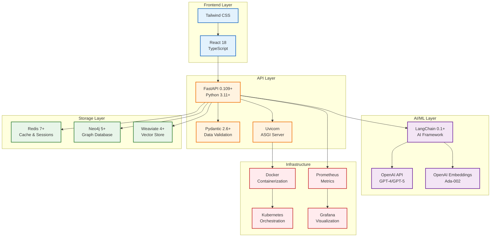

---

## Summary

This document provides comprehensive architectural visualizations of the Agentic Workflow System at multiple levels of abstraction:

1. **20,000 Feet View**: Complete system overview with all major components
2. **Module Diagrams**: Internal structure of key modules (Agents, Memory, Tools)
3. **Sequence Diagrams**: Detailed interaction flows for core operations
4. **Data Flow Diagrams**: Data movement through the system
5. **Deployment Architecture**: Production infrastructure layout
6. **Technology Stack**: Technologies and versions used

**Usage:**
- Architecture reviews: Use 20,000 feet diagram
- Development planning: Use module and component diagrams
- Debugging: Use sequence and data flow diagrams
- DevOps planning: Use deployment architecture
- Technology decisions: Use technology stack diagram

**Maintenance:**
- Review and update diagrams with each major release
- Update when significant architectural changes occur
- Keep synchronized with implementation

---

**Document Owner:** Solutions Architect  
**Contributors:** Engineering Team  
**Last Updated:** November 9, 2025  
**Next Review:** December 9, 2025
