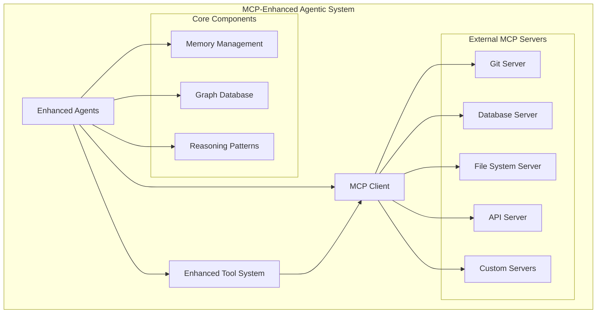

# Agentic Workflow Design

## Levels of Agentic Behavior

### Level 1: AI Workflows (Output Decisions)
- **Focus**: Models making decisions based on natural language instructions
- **Implementation**:
  - Natural language processing for task understanding
  - Decision trees for output selection
  - Basic validation and error checking
  - Integration with existing tools and APIs

### Level 2: Router Workflows (Task Decisions)
- **Focus**: AI models deciding on tools and execution paths
- **Implementation**:
  - Task decomposition and routing
  - Tool selection and orchestration
  - Execution path optimization
  - State management and progress tracking

### Level 3: Autonomous Agents (Process Decisions)
- **Focus**: Complete control over application flow and code generation
- **Implementation**:
  - Self-modifying code capabilities
  - Dynamic tool creation
  - Autonomous problem-solving
  - Learning and adaptation

## Design Patterns and Strategies

### 1. Chain of Thought (CoT)
- **Purpose**: Break down complex tasks into manageable steps
- **Implementation**:
  - Task decomposition algorithms
  - Step-by-step reasoning
  - Progress tracking
  - Validation at each step

### 2. ReAct (Reasoning and Acting)
- **Purpose**: Combine reasoning and action in a feedback loop
- **Implementation**:
  - Action planning
  - Execution monitoring
  - Result evaluation
  - Strategy adjustment

### 3. Self-Refine
- **Purpose**: Enable agents to improve their outputs
- **Implementation**:
  - Output evaluation
  - Quality metrics
  - Iterative improvement
  - Learning from feedback

### 4. RAISE (Reasoning, Acting, Interacting, Self-Evaluating)
- **Purpose**: Comprehensive approach to agent behavior
- **Implementation**:
  - Multi-agent communication
  - Task coordination
  - Performance evaluation
  - Strategy optimization

### 5. Reflexion
- **Purpose**: Learn from past experiences
- **Implementation**:
  - Experience logging
  - Pattern recognition
  - Strategy adaptation
  - Performance improvement

### 6. LATM (LLMs as Tool Makers)
- **Purpose**: Enable agents to create their own tools
- **Implementation**:
  - Tool generation
  - Tool validation
  - Tool integration
  - Tool optimization

## Integration with Graph Architecture

### Knowledge Graph Integration
- Store agent knowledge and experiences
- Track relationships between tasks and solutions
- Maintain context and history
- Enable pattern recognition

### Task Graph Integration
- Map task dependencies
- Track execution progress
- Manage resource allocation
- Optimize workflow paths

### Skill Graph Integration
- Track agent capabilities
- Map skill dependencies
- Enable skill sharing
- Optimize skill utilization

## Model Context Protocol (MCP) Integration

### MCP Enhancement Layer
The agentic workflow system is enhanced with Model Context Protocol (MCP) integration, providing:

- **Dynamic Capability Discovery**: Runtime discovery and integration of external tools and data sources
- **Real-time Data Access**: Live connections to databases, APIs, file systems, and development tools
- **External Service Integration**: Seamless integration with Git, IDEs, CI/CD, monitoring, and communication tools
- **Custom Capability Creation**: Framework for building specialized MCP servers for domain-specific needs
- **Secure Resource Access**: Controlled, authenticated access to sensitive external resources

### MCP-Enhanced Architecture

### Integration Benefits

**For Existing Design Patterns**:
- **Chain of Thought (CoT)**: Enhanced with real-time data and dynamic capability awareness
- **ReAct**: Action space expanded with unlimited external tools and data sources
- **Self-Refine**: Improvement based on live feedback from external systems
- **RAISE**: Multi-agent coordination with shared external resources
- **Reflexion**: Learning from external system interactions and outcomes
- **LATM**: Dynamic tool creation enhanced with MCP server development capabilities

**For System Capabilities**:
- **Level 1 (AI Workflows)**: Enhanced decision making with real-time context
- **Level 2 (Router Workflows)**: Dynamic tool routing with runtime capability discovery
- **Level 3 (Autonomous Agents)**: Complete autonomy with unlimited external resource access

### MCP Implementation Phases

#### Phase 1: MCP Foundation (Weeks 1-2)
1. **MCP Client Implementation**: Core client with server discovery and management
2. **Tool System Enhancement**: Integrate MCP tools with existing tool system
3. **Agent Framework Enhancement**: Add MCP awareness to agent base classes
4. **Security Framework**: Basic authentication and authorization for MCP operations

#### Phase 2: Core MCP Integration (Weeks 3-4)
1. **Essential Server Connections**: Git, file system, database, and API servers
2. **Memory System Integration**: Enhanced context management with MCP resources
3. **Reasoning Pattern Enhancement**: Integrate MCP capabilities with CoT and ReAct
4. **Performance Optimization**: Caching, connection pooling, and monitoring

#### Phase 3: Advanced MCP Features (Weeks 5-6)
1. **Custom Server Development**: Domain-specific MCP servers for agentic workflows
2. **Multi-Agent Coordination**: Enhanced agent communication through MCP
3. **Dynamic Capability Management**: Runtime capability discovery and adaptation
4. **Advanced Security**: Production-ready security and compliance features

#### Phase 4: MCP Production Readiness (Weeks 7-8)
1. **Monitoring and Observability**: Complete MCP operation monitoring
2. **Performance Tuning**: Optimization for production workloads
3. **Documentation and Training**: Comprehensive MCP integration documentation
4. **Deployment Automation**: Automated MCP server deployment and management

## Implementation Strategy

### Phase 1: Level 1 Implementation
1. Set up basic AI workflows
2. Implement natural language processing
3. Create decision trees
4. Establish validation mechanisms

### Phase 2: Level 2 Implementation
1. Develop task routing system
2. Implement tool orchestration
3. Create execution path management
4. Establish state tracking

### Phase 3: Level 3 Implementation
1. Enable autonomous code generation
2. Implement dynamic tool creation
3. Develop learning mechanisms
4. Establish adaptation strategies

## Success Metrics

### Performance Metrics
- Task completion rate
- Error reduction
- Response time
- Resource utilization

### Quality Metrics
- Output accuracy
- Solution completeness
- Code quality
- Documentation quality

### Learning Metrics
- Pattern recognition success
- Strategy improvement
- Tool creation effectiveness
- Adaptation success

## Next Steps
1. Begin Phase 1 implementation
2. Set up monitoring and metrics
3. Create initial test cases
4. Establish feedback mechanisms
5. Begin documentation
