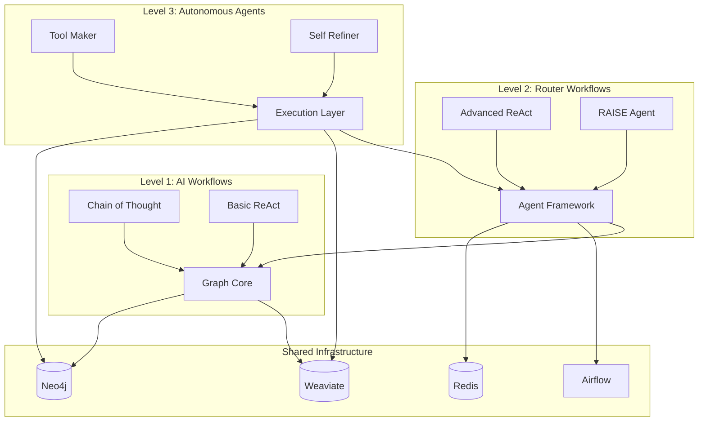

# Component Relationships

## Overview
This document explains how the different components of our agentic workflow system interact and work together across different levels of implementation.

## Component Interaction Map

## Detailed Component Relationships

### 1. Level 1 Components (AI Workflows)

#### Chain of Thought (CoT) → Graph Core
- **Interaction**: CoT uses Graph Core to store and retrieve task decomposition
- **Data Flow**:
  1. CoT analyzes tasks using NLP
  2. Results stored in Neo4j as task graphs
  3. Validation performed using NetworkX
  4. Vector embeddings stored in Weaviate

#### Basic ReAct → Graph Core
- **Interaction**: Basic ReAct uses Graph Core for reasoning and action storage
- **Data Flow**:
  1. ReAct processes input
  2. Reasoning stored in Neo4j
  3. Action results stored in Weaviate
  4. Validation performed using NetworkX

### 2. Level 2 Components (Router Workflows)

#### Advanced ReAct → Agent Framework
- **Interaction**: Advanced ReAct uses Agent Framework for complex task handling
- **Data Flow**:
  1. ReAct processes complex tasks
  2. State managed in Redis
  3. Tasks orchestrated via Airflow
  4. Results stored in Neo4j

#### RAISE → Agent Framework
- **Interaction**: RAISE coordinates multiple agents through the framework
- **Data Flow**:
  1. RAISE decomposes tasks
  2. Coordinates agents via Redis
  3. Tracks progress in Neo4j
  4. Manages workflow in Airflow

### 3. Level 3 Components (Autonomous Agents)

#### Tool Maker → Execution Layer
- **Interaction**: Tool Maker creates and manages tools through Execution Layer
- **Data Flow**:
  1. Tool Maker analyzes requirements
  2. Generates tool code
  3. Stores tool metadata in Neo4j
  4. Manages tool lifecycle in Airflow

#### Self Refiner → Execution Layer
- **Interaction**: Self Refiner improves outputs through Execution Layer
- **Data Flow**:
  1. Self Refiner evaluates outputs
  2. Stores improvements in Weaviate
  3. Updates knowledge in Neo4j
  4. Tracks progress in Redis

## Shared Infrastructure Usage

### Neo4j
- **Primary Use**: Knowledge and relationship storage
- **Accessed By**:
  - Graph Core (task graphs)
  - Agent Framework (agent state)
  - Execution Layer (tool metadata)

### Weaviate
- **Primary Use**: Vector storage and similarity search
- **Accessed By**:
  - Graph Core (embeddings)
  - Agent Framework (semantic search)
  - Execution Layer (output storage)

### Redis
- **Primary Use**: State management and caching
- **Accessed By**:
  - Agent Framework (agent state)
  - Execution Layer (tool state)
  - RAISE (coordination)

### Airflow
- **Primary Use**: Workflow orchestration
- **Accessed By**:
  - Graph Core (task execution)
  - Agent Framework (agent coordination)
  - Execution Layer (tool execution)

## Data Flow Patterns

### 1. Task Processing Flow
1. Input received by Graph Core
2. Processed by appropriate level components
3. Results stored in relevant databases
4. Feedback loop for improvement

### 2. Learning Flow
1. Experience captured by components
2. Stored in appropriate databases
3. Analyzed for patterns
4. Used to improve future performance

### 3. Tool Creation Flow
1. Requirement received by Tool Maker
2. Tool generated and validated
3. Registered in Execution Layer
4. Made available to other components

## Error Handling and Recovery

### Component-Level Recovery
- Each component implements its own error handling
- Errors logged to appropriate systems
- Recovery strategies defined per component

### System-Level Recovery
- Cross-component error handling
- State recovery mechanisms
- Fallback strategies

## Monitoring and Metrics

### Component Metrics
- Each component reports its own metrics
- Metrics aggregated at system level
- Used for performance optimization

### System Metrics
- Overall system health
- Component interaction performance
- Resource utilization

## Next Steps
1. Implement component interfaces
2. Set up monitoring
3. Create test scenarios
4. Document integration points
5. Establish error handling 