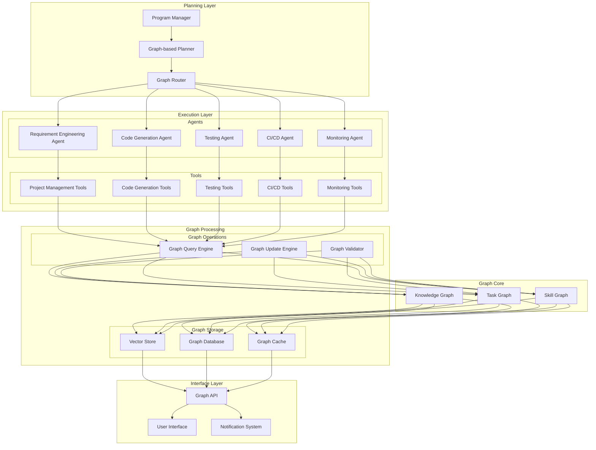
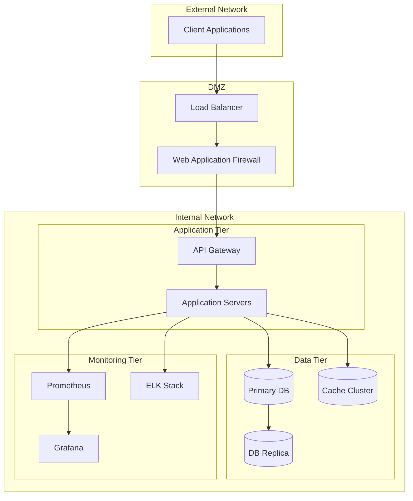
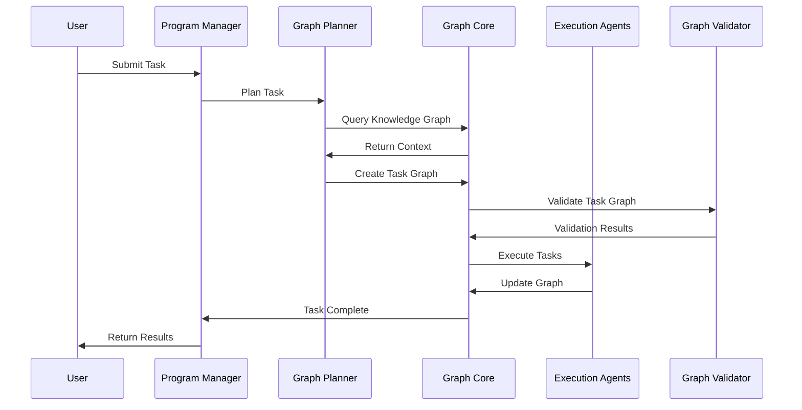
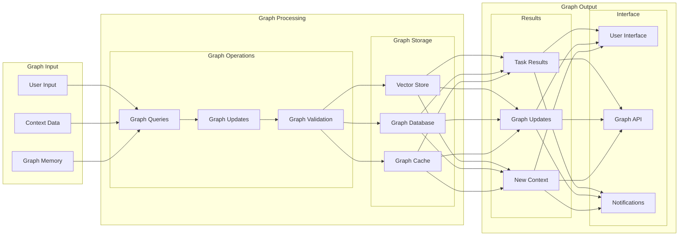

# Architecture Design

## System Architecture Diagram

## Network Architecture Diagram

## Graph-based Workflow Sequence

## Graph Data Flow

## Key Components

1. **Requirement Engineering Agent**: Gathers and documents project requirements.
2. **Code Generation Agent**: Generates code snippets and solutions using the OpenAI API.
3. **Testing Agent**: Executes automated tests and reports results.
4. **CI/CD Agent**: Manages the CI/CD pipeline using GitLab CI/CD.
5. **Project Management Agent**: Tracks tasks and manages project workflows using GitLab.
6. **Monitoring Agent**: Tracks performance metrics and alerts on issues using Prometheus, Grafana, ELK Stack, and Sentry.
7. **Program Manager**: Oversees the entire workflow, ensuring alignment with organizational goals and effective coordination of all components.

## Component Interactions

- **Requirement Engineering Agent** interacts with the **Project Management Agent** to update task statuses and requirements.
- **Code Generation Agent** interacts with the **CI/CD Agent** to integrate generated code into the CI/CD pipeline.
- **Testing Agent** interacts with the **CI/CD Agent** to run tests as part of the CI/CD process.
- **Monitoring Agent** interacts with all other agents to track performance and alert on issues.
- **Program Manager** interacts with all agents to ensure alignment with project goals and establishes a feedback loop with stakeholders and the team.

## Data Flow

- **Input Sources**:
  - **User Input**: Data provided by users through interfaces or forms.
  - **External APIs**: Data fetched from third-party APIs or services.
  - **Databases**: Data retrieved from databases or data warehouses.
  - **Sensors/IoT Devices**: Data collected from sensors or IoT devices, if applicable.

- **Processing Steps**:
  - **Data Ingestion**: Collecting and importing data from various sources.
  - **Data Transformation**: Converting data into a suitable format for analysis or processing.
  - **Data Validation**: Ensuring data integrity and accuracy.
  - **Data Analysis**: Analyzing data to extract insights or perform specific tasks.
  - **Data Storage**: Storing processed data for future use or reference.

- **Output Destinations**:
  - **User Interfaces**: Displaying results or insights to users through dashboards or reports.
  - **Databases**: Storing processed data for future use.
  - **External Systems**: Sending data to other systems or services for further processing or integration.
  - **Notifications**: Sending alerts or notifications based on data analysis results.

## Security Considerations

- **Data Protection**:
  - **Encryption**: Implement encryption for data at rest and in transit to protect sensitive information.
  - **Data Masking**: Use data masking techniques to anonymize sensitive data in non-production environments.
  - **Secure Storage**: Ensure that data is stored securely, with access controls and audit logs in place.

- **Compliance**:
  - **Regulatory Compliance**: Ensure compliance with relevant regulations, such as GDPR, HIPAA, or industry-specific standards.
  - **Audit Trails**: Maintain audit trails to track access and changes to sensitive data.
  - **Regular Audits**: Conduct regular security audits to identify and address vulnerabilities.

- **Access Control**:
  - **Authentication**: Implement strong authentication mechanisms, such as multi-factor authentication (MFA).
  - **Authorization**: Define role-based access control (RBAC) to restrict access to sensitive data and functions.
  - **Session Management**: Manage user sessions securely, with timeouts and secure session handling.

- **Security Monitoring**:
  - **Intrusion Detection**: Use intrusion detection systems to monitor for suspicious activities.
  - **Logging and Monitoring**: Implement comprehensive logging and monitoring to detect and respond to security incidents.
  - **Incident Response**: Develop and maintain an incident response plan to address security breaches promptly.

## Scalability and Performance

- **Scaling Strategy**:
  - **Horizontal Scaling**: Add more instances of components to handle increased load.
  - **Vertical Scaling**: Increase the resources (e.g., CPU, memory) of existing instances.
  - **Load Balancing**: Distribute traffic across multiple instances to ensure even load distribution.

- **Performance Optimization**:
  - **Caching**: Implement caching strategies to reduce latency and improve response times.
  - **Asynchronous Processing**: Use asynchronous processing for tasks that do not require immediate results.
  - **Resource Management**: Optimize resource usage to ensure efficient performance.

## Deployment Strategy

- **Environments**:
  - **Development**: Used for initial development and testing.
  - **Testing**: Used for comprehensive testing before production deployment.
  - **Production**: The live environment where the workflow is fully operational.

- **Deployment Methods**:
  - **Containerization**: Use Docker to containerize components for consistent deployment.
  - **Serverless Deployment**: Deploy components using serverless platforms for automatic scaling and management.
  - **Continuous Deployment**: Automate the deployment process to ensure quick and reliable updates.

## Error Handling and Recovery

- **Error Detection**:
  - **Logging**: Implement comprehensive logging to capture errors and exceptions.
  - **Monitoring**: Use monitoring tools to detect anomalies and errors in real-time.

- **Recovery Procedures**:
  - **Automatic Recovery**: Implement automatic recovery mechanisms to handle common errors.
  - **Manual Intervention**: Define procedures for manual intervention in case of critical errors.
  - **Backup and Restore**: Maintain backups to restore the system in case of data loss or corruption.

## User Interface

- **Dashboards**:
  - **Real-time Monitoring**: Provide dashboards for real-time monitoring of workflow performance.
  - **User Interaction**: Design intuitive interfaces for users to interact with the workflow.

- **User Experience**:
  - **Accessibility**: Ensure the interface is accessible to all users, including those with disabilities.
  - **Responsive Design**: Design the interface to be responsive and work well on various devices.

## Integration with External Systems

- **Third-Party APIs**:
  - **API Integration**: Integrate with third-party APIs to extend the workflow's capabilities.
  - **Data Exchange**: Ensure secure and efficient data exchange with external systems.

- **Databases**:
  - **Data Storage**: Use databases to store and retrieve data efficiently.
  - **Data Synchronization**: Implement mechanisms to synchronize data between the workflow and external databases.
