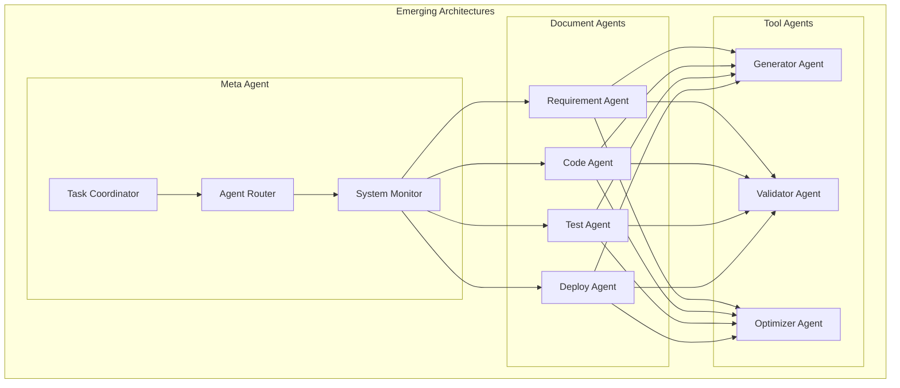
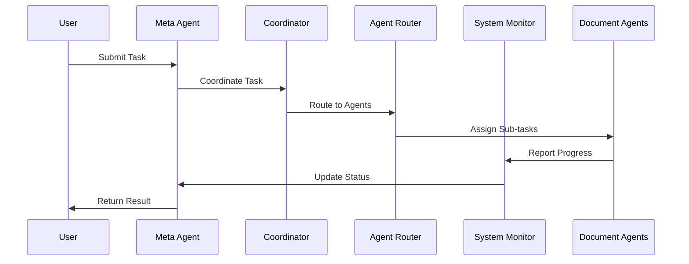
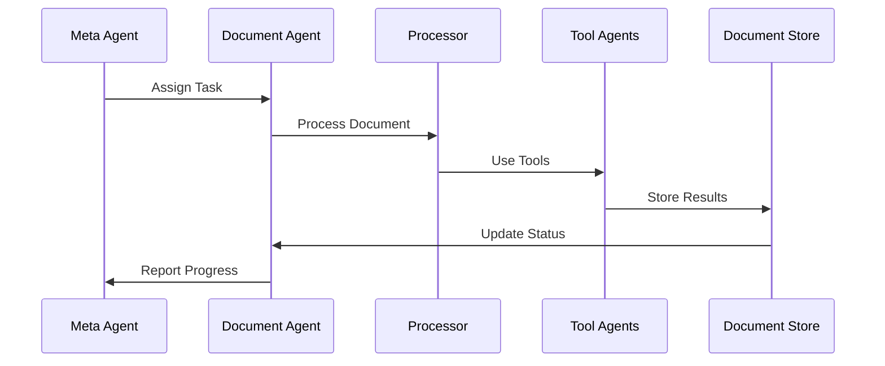
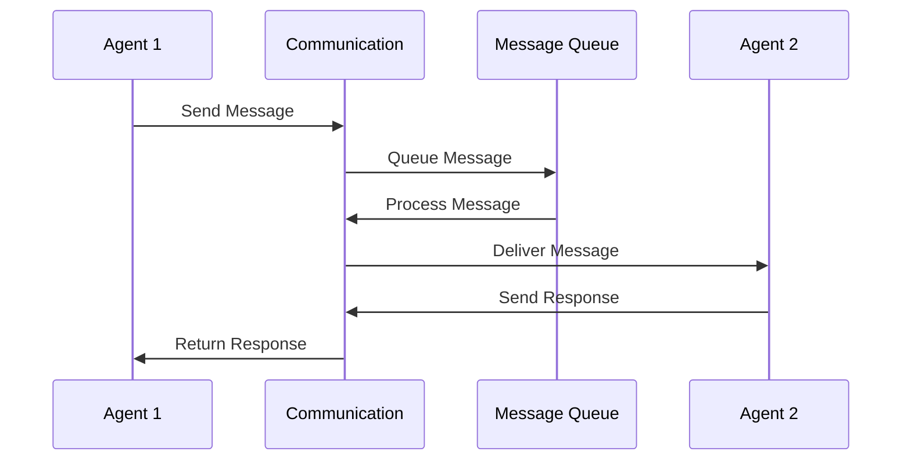
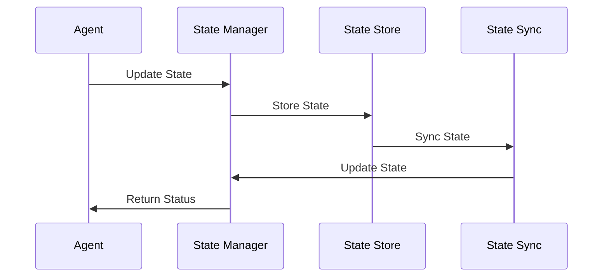

# Emerging Architectures Implementation

## Overview
This document outlines the implementation of emerging architectures for our agentic workflow system, focusing on document agents and meta-agent coordination.

## Architecture Overview



## Implementation Details

### 1. Meta Agent Implementation



#### Implementation Steps:
1. **Task Coordination**
   - Implement task decomposition
   - Define coordination rules
   - Handle task distribution

2. **Agent Routing**
   - Implement routing logic
   - Define routing rules
   - Handle agent selection

3. **System Monitoring**
   - Implement monitoring system
   - Define monitoring rules
   - Handle system status

### 2. Document Agent Implementation



#### Implementation Steps:
1. **Document Processing**
   - Implement document analysis
   - Define processing rules
   - Handle document updates

2. **Tool Integration**
   - Implement tool interfaces
   - Define tool rules
   - Handle tool results

3. **Document Storage**
   - Implement storage system
   - Define storage rules
   - Handle document versioning

### 3. Tool Agent Implementation

```mermaid
sequenceDiagram
    participant Doc as Document Agent
    participant Tool as Tool Agent
    participant Gen as Generator
    participant Val as Validator
    participant Opt as Optimizer

    Doc->>Tool: Request Tool
    Tool->>Gen: Generate Tool
    Gen->>Val: Validate Tool
    Val->>Opt: Optimize Tool
    Opt->>Tool: Return Tool
    Tool->>Doc: Provide Tool
```

#### Implementation Steps:
1. **Tool Generation**
   - Implement generator engine
   - Define generation rules
   - Handle generation results

2. **Tool Validation**
   - Implement validator engine
   - Define validation rules
   - Handle validation results

3. **Tool Optimization**
   - Implement optimizer engine
   - Define optimization rules
   - Handle optimization results

### 4. Agent Communication



#### Implementation Steps:
1. **Message Handling**
   - Implement message system
   - Define message formats
   - Handle message routing

2. **Queue Management**
   - Implement queue system
   - Define queue rules
   - Handle queue processing

3. **Response Handling**
   - Implement response system
   - Define response rules
   - Handle response processing

### 5. State Management



#### Implementation Steps:
1. **State Tracking**
   - Implement state system
   - Define state rules
   - Handle state updates

2. **State Storage**
   - Implement storage system
   - Define storage rules
   - Handle storage operations

3. **State Synchronization**
   - Implement sync system
   - Define sync rules
   - Handle sync operations

## Implementation Timeline

### Phase 1: Foundation (Weeks 1-2)
1. Implement Meta Agent
   - Task coordination
   - Agent routing
   - System monitoring

### Phase 2: Document Agents (Weeks 3-4)
1. Implement Document Agents
   - Document processing
   - Tool integration
   - Document storage

### Phase 3: Tool Agents (Weeks 5-6)
1. Implement Tool Agents
   - Tool generation
   - Tool validation
   - Tool optimization

### Phase 4: Integration (Weeks 7-8)
1. Implement Integration
   - Agent communication
   - State management
   - System coordination

## Next Steps
1. Set up development environment
2. Create initial test cases
3. Implement basic components
4. Establish monitoring
5. Begin documentation
