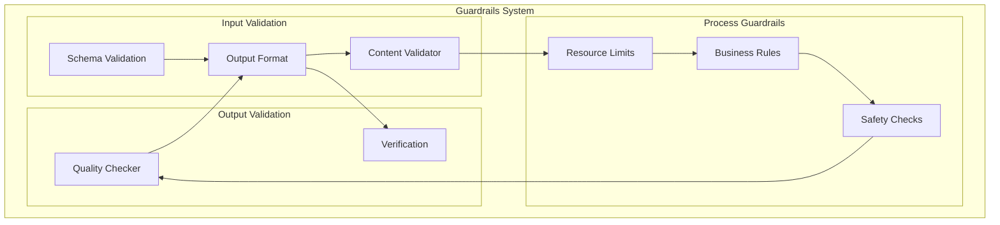
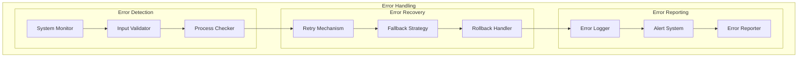
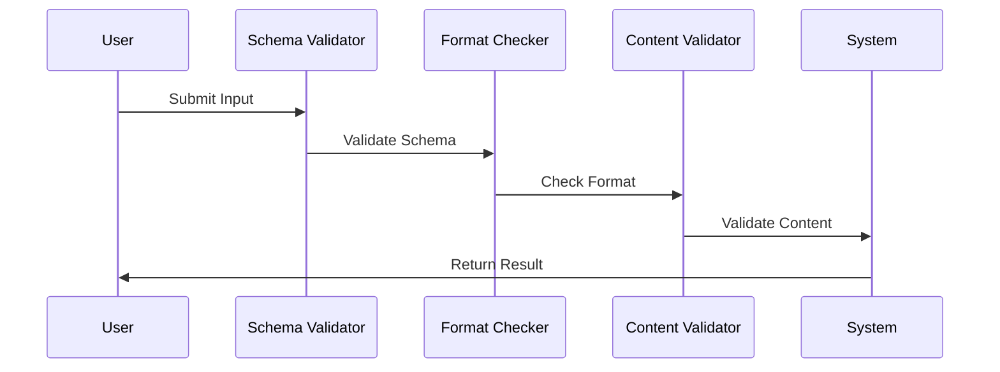
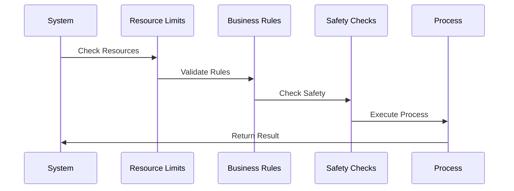
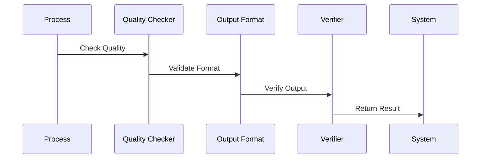
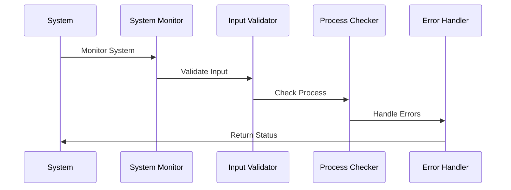
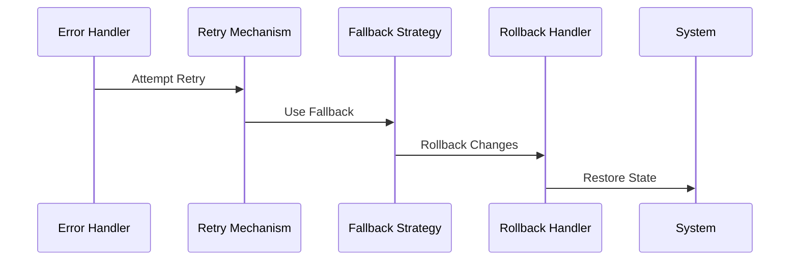
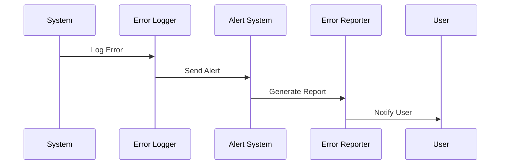

# Guardrails and Error Handling Implementation

## Overview
This document outlines the implementation of guardrails and error handling mechanisms to ensure smooth operation of our agentic workflow system.

## Guardrails Architecture

## Error Handling Architecture

## Implementation Details

### 1. Input Validation Guardrails

#### Implementation Steps:
1. **Schema Validation**
   - Implement JSON schema validation
   - Define input schemas
   - Handle schema violations

2. **Format Checking**
   - Implement format validators
   - Define format rules
   - Handle format errors

3. **Content Validation**
   - Implement content checks
   - Define content rules
   - Handle content violations

### 2. Process Guardrails

#### Implementation Steps:
1. **Resource Limits**
   - Implement resource monitoring
   - Define limit thresholds
   - Handle limit violations

2. **Business Rules**
   - Implement rule engine
   - Define business rules
   - Handle rule violations

3. **Safety Checks**
   - Implement safety validators
   - Define safety rules
   - Handle safety violations

### 3. Output Validation

#### Implementation Steps:
1. **Quality Checking**
   - Implement quality metrics
   - Define quality thresholds
   - Handle quality violations

2. **Format Validation**
   - Implement format checkers
   - Define output formats
   - Handle format violations

3. **Output Verification**
   - Implement verification rules
   - Define verification criteria
   - Handle verification failures

### 4. Error Detection

#### Implementation Steps:
1. **System Monitoring**
   - Implement monitoring agents
   - Define monitoring metrics
   - Handle monitoring alerts

2. **Input Validation**
   - Implement input validators
   - Define validation rules
   - Handle validation errors

3. **Process Checking**
   - Implement process checkers
   - Define check criteria
   - Handle check failures

### 5. Error Recovery

#### Implementation Steps:
1. **Retry Mechanism**
   - Implement retry logic
   - Define retry policies
   - Handle retry failures

2. **Fallback Strategy**
   - Implement fallback options
   - Define fallback rules
   - Handle fallback failures

3. **Rollback Handler**
   - Implement rollback logic
   - Define rollback points
   - Handle rollback failures

### 6. Error Reporting

#### Implementation Steps:
1. **Error Logging**
   - Implement logging system
   - Define log formats
   - Handle log management

2. **Alert System**
   - Implement alert mechanisms
   - Define alert rules
   - Handle alert delivery

3. **Error Reporting**
   - Implement reporting system
   - Define report formats
   - Handle report delivery

## Implementation Timeline

### Phase 1: Foundation (Weeks 1-2)
1. Implement input validation
   - Schema validation
   - Format checking
   - Content validation

### Phase 2: Process (Weeks 3-4)
1. Implement process guardrails
   - Resource limits
   - Business rules
   - Safety checks

### Phase 3: Output (Weeks 5-6)
1. Implement output validation
   - Quality checking
   - Format validation
   - Output verification

### Phase 4: Error Handling (Weeks 7-8)
1. Implement error handling
   - Error detection
   - Error recovery
   - Error reporting

## Next Steps
1. Set up development environment
2. Create initial test cases
3. Implement basic components
4. Establish monitoring
5. Begin documentation 