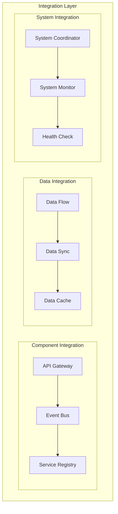
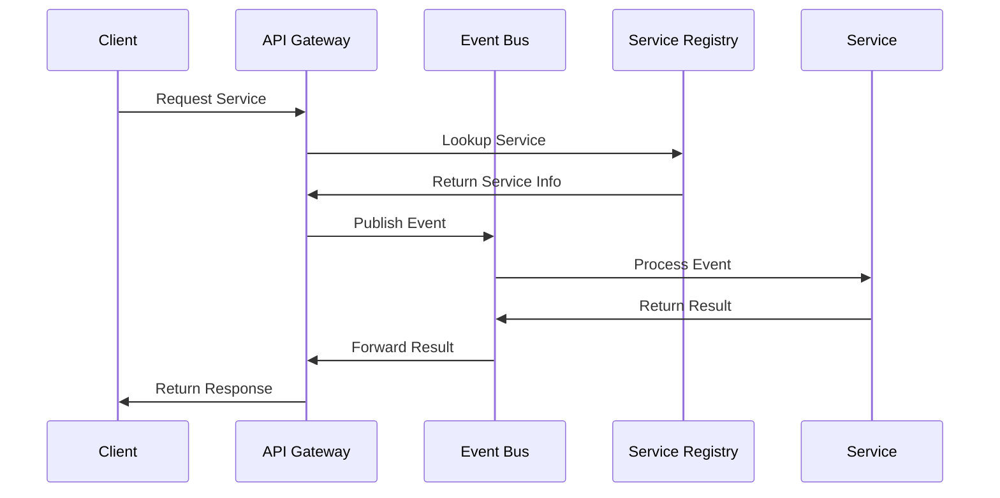
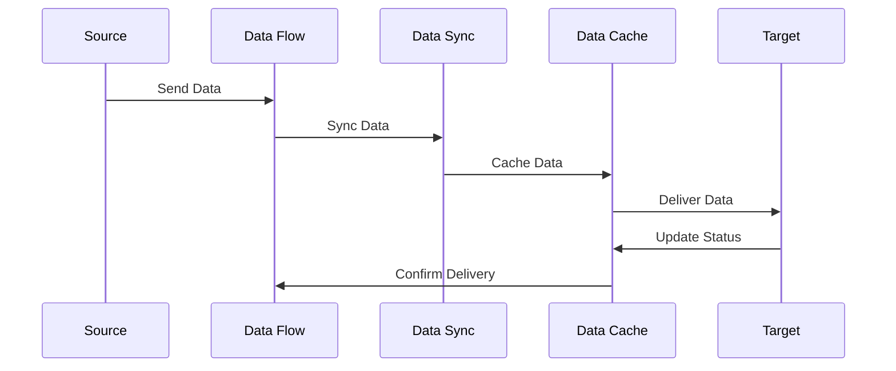
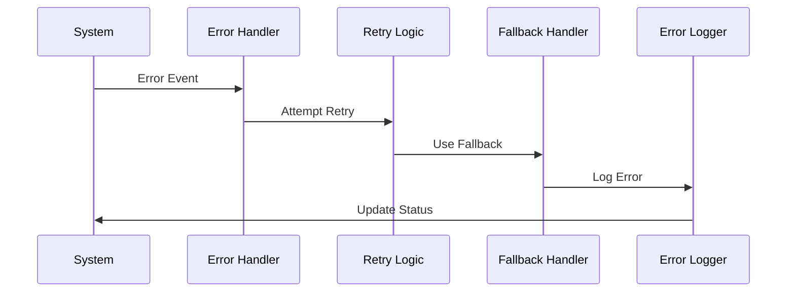
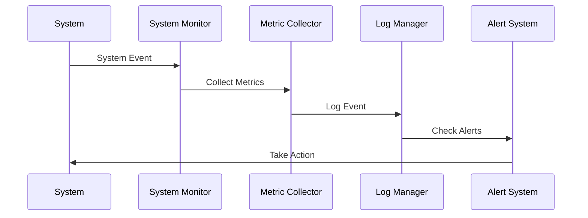

# Integration Strategies Implementation

## Overview
This document outlines the implementation of integration strategies for our agentic workflow system, focusing on component integration, data flow, and system coordination.

## Integration Architecture

## Implementation Details

### 1. Component Integration

#### Implementation Steps:
1. **API Gateway**
   - Implement routing logic
   - Define API endpoints
   - Handle request/response

2. **Event Bus**
   - Implement event system
   - Define event types
   - Handle event routing

3. **Service Registry**
   - Implement registry system
   - Define service metadata
   - Handle service discovery

### 2. Data Integration

#### Implementation Steps:
1. **Data Flow**
   - Implement flow system
   - Define flow rules
   - Handle data routing

2. **Data Sync**
   - Implement sync system
   - Define sync rules
   - Handle data consistency

3. **Data Cache**
   - Implement cache system
   - Define cache rules
   - Handle data storage

### 3. System Integration

#### Implementation Steps:
1. **System Coordinator**
   - Implement coordination logic
   - Define coordination rules
   - Handle system events

2. **System Monitor**
   - Implement monitoring system
   - Define monitoring rules
   - Handle system status

3. **Health Check**
   - Implement health checks
   - Define health rules
   - Handle system health

### 4. Error Handling

#### Implementation Steps:
1. **Error Handler**
   - Implement error handling
   - Define error types
   - Handle error recovery

2. **Retry Logic**
   - Implement retry system
   - Define retry rules
   - Handle retry attempts

3. **Fallback Handler**
   - Implement fallback system
   - Define fallback rules
   - Handle fallback actions

### 5. Monitoring and Logging

#### Implementation Steps:
1. **System Monitor**
   - Implement monitoring
   - Define metrics
   - Handle system events

2. **Metric Collector**
   - Implement collection
   - Define collection rules
   - Handle metric storage

3. **Log Manager**
   - Implement logging
   - Define log levels
   - Handle log storage

## Implementation Timeline

### Phase 1: Foundation (Weeks 1-2)
1. Implement Component Integration
   - API Gateway
   - Event Bus
   - Service Registry

### Phase 2: Data (Weeks 3-4)
1. Implement Data Integration
   - Data Flow
   - Data Sync
   - Data Cache

### Phase 3: System (Weeks 5-6)
1. Implement System Integration
   - System Coordinator
   - System Monitor
   - Health Check

### Phase 4: Operations (Weeks 7-8)
1. Implement Operations
   - Error Handling
   - Monitoring
   - Logging

## Next Steps
1. Set up development environment
2. Create initial test cases
3. Implement basic components
4. Establish monitoring
5. Begin documentation 