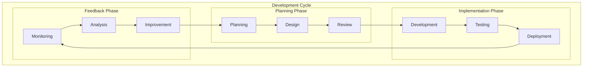
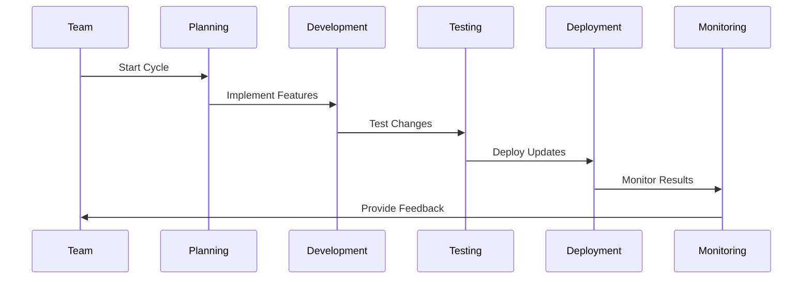
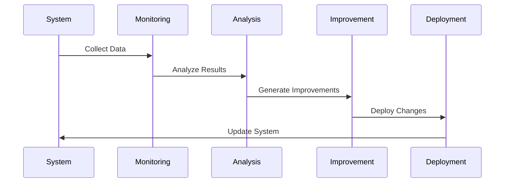
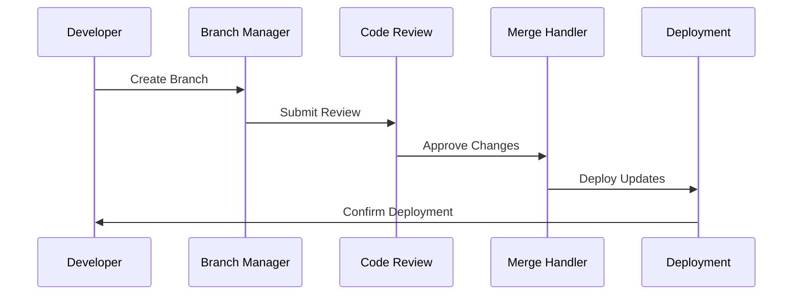
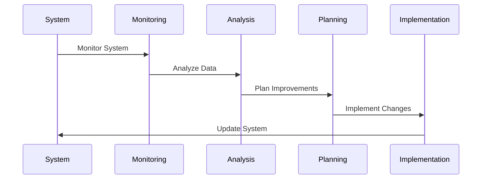
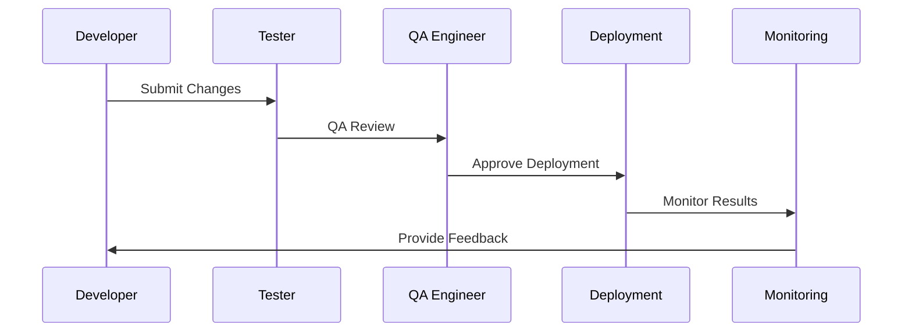

# Iterative Development Implementation

## Overview
This document outlines the iterative development process for our agentic workflow system, focusing on development cycles, feedback loops, and continuous improvement.

## Development Architecture

## Implementation Details

### 1. Development Cycles

#### Implementation Steps:
1. **Planning Phase**
   - Define objectives
   - Set priorities
   - Allocate resources

2. **Development Phase**
   - Implement features
   - Write tests
   - Document changes

3. **Testing Phase**
   - Run tests
   - Fix issues
   - Validate changes

4. **Deployment Phase**
   - Deploy updates
   - Monitor performance
   - Collect feedback

### 2. Feedback Loops

#### Implementation Steps:
1. **Data Collection**
   - Gather metrics
   - Collect feedback
   - Monitor performance

2. **Analysis**
   - Analyze data
   - Identify issues
   - Generate insights

3. **Improvement**
   - Plan changes
   - Implement fixes
   - Validate improvements

### 3. Version Control

#### Implementation Steps:
1. **Branch Management**
   - Create branches
   - Manage versions
   - Handle conflicts

2. **Code Review**
   - Review changes
   - Provide feedback
   - Approve updates

3. **Merge Process**
   - Merge changes
   - Resolve conflicts
   - Deploy updates

### 4. Continuous Improvement

#### Implementation Steps:
1. **Monitoring**
   - Track metrics
   - Monitor performance
   - Collect feedback

2. **Analysis**
   - Analyze data
   - Identify issues
   - Generate insights

3. **Implementation**
   - Plan changes
   - Implement fixes
   - Validate improvements

### 5. Quality Assurance

#### Implementation Steps:
1. **Testing**
   - Run tests
   - Fix issues
   - Validate changes

2. **QA Review**
   - Review changes
   - Verify quality
   - Approve updates

3. **Deployment**
   - Deploy changes
   - Monitor results
   - Collect feedback

## Implementation Timeline

### Phase 1: Foundation (Weeks 1-2)
1. Set up development environment
   - Version control
   - CI/CD pipeline
   - Testing framework

### Phase 2: Process (Weeks 3-4)
1. Implement development cycles
   - Planning phase
   - Development phase
   - Testing phase

### Phase 3: Feedback (Weeks 5-6)
1. Implement feedback loops
   - Data collection
   - Analysis
   - Improvement

### Phase 4: Quality (Weeks 7-8)
1. Implement quality assurance
   - Testing
   - QA review
   - Deployment

## Next Steps
1. Set up development environment
2. Create initial test cases
3. Implement basic processes
4. Establish monitoring
5. Begin documentation
