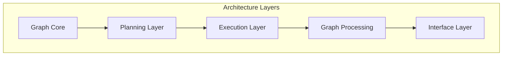
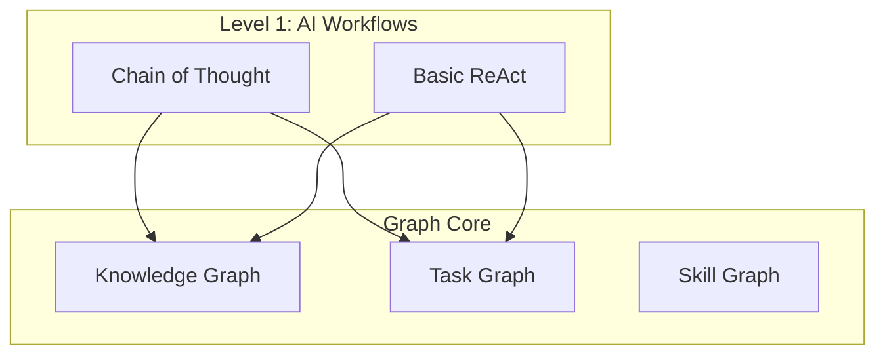
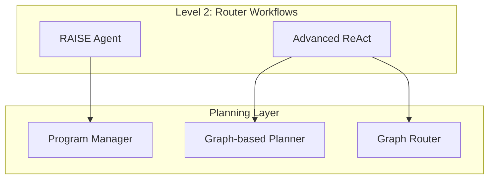
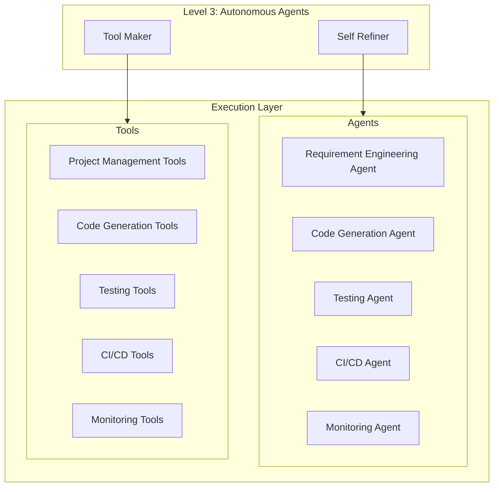
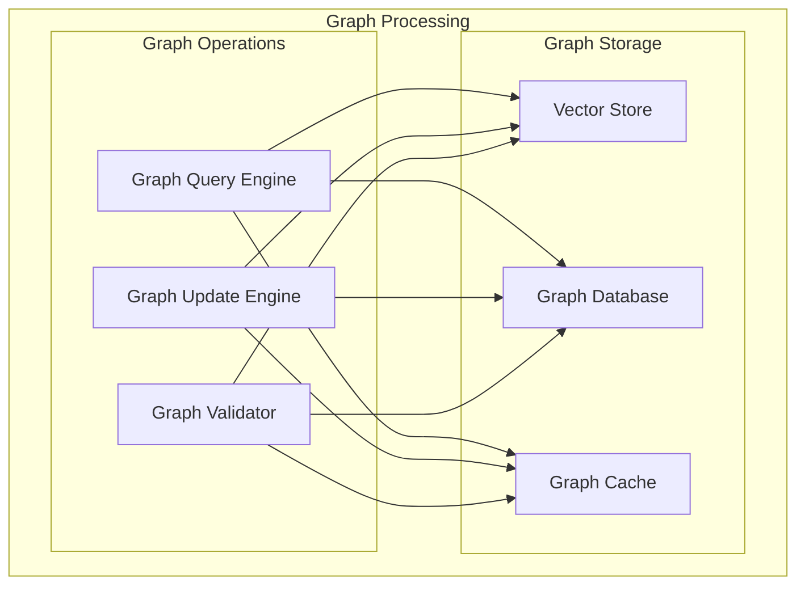
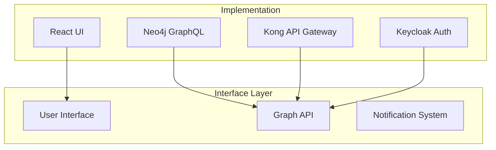
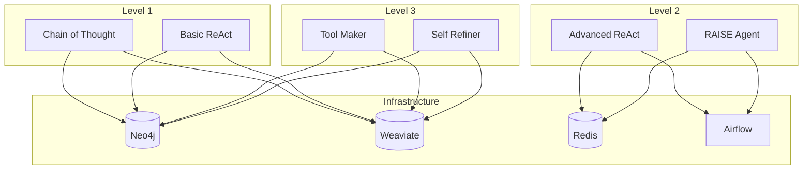

# Architecture to Component Mapping

## Overview
This document maps our component relationships to the architecture design, showing how the different levels of agentic behavior fit into our system architecture.

## Architecture Diagrams

### 1. Core Architecture Layers

### 2. Graph Core Components

### 3. Planning Layer Components

### 4. Execution Layer Components

### 5. Graph Processing Components

### 6. Interface Layer Components

### 7. Component Interactions

## Detailed Mapping

### 1. Graph Core Layer

#### Knowledge Graph
- **Level 1 Components**:
  - Chain of Thought: Stores task decomposition
  - Basic ReAct: Stores reasoning patterns
- **Implementation**:
  - Neo4j for graph storage
  - Weaviate for vector embeddings
  - NetworkX for graph operations

#### Task Graph
- **Level 1 Components**:
  - Chain of Thought: Manages task dependencies
  - Basic ReAct: Tracks action sequences
- **Implementation**:
  - Airflow for task orchestration
  - Neo4j for task relationships
  - Redis for task state

#### Skill Graph
- **Level 1 Components**:
  - Chain of Thought: Maps skill requirements
  - Basic ReAct: Tracks skill usage
- **Implementation**:
  - Neo4j for skill relationships
  - Weaviate for skill embeddings
  - NetworkX for skill validation

### 2. Planning Layer

#### Program Manager
- **Level 2 Components**:
  - Advanced ReAct: Complex task planning
  - RAISE: Multi-agent coordination
- **Implementation**:
  - LangChain for agent management
  - Redis for state management
  - Airflow for workflow orchestration

#### Graph-based Planner
- **Level 2 Components**:
  - Advanced ReAct: Action planning
  - RAISE: Task coordination
- **Implementation**:
  - Neo4j for plan storage
  - Weaviate for plan similarity
  - Airflow for plan execution

#### Graph Router
- **Level 2 Components**:
  - Advanced ReAct: Path selection
  - RAISE: Agent routing
- **Implementation**:
  - Neo4j for routing rules
  - Redis for routing state
  - Airflow for route execution

### 3. Execution Layer

#### Agents
- **Level 3 Components**:
  - Tool Maker: Creates new tools
  - Self Refiner: Improves agent behavior
- **Implementation**:
  - LangChain for agent framework
  - Neo4j for agent knowledge
  - Redis for agent state

#### Tools
- **Level 3 Components**:
  - Tool Maker: Generates tools
  - Self Refiner: Optimizes tools
- **Implementation**:
  - Neo4j for tool metadata
  - Weaviate for tool embeddings
  - Airflow for tool execution

### 4. Graph Processing

#### Graph Operations
- **All Levels**:
  - Query Engine: Used by all components
  - Update Engine: Used by all components
  - Validator: Used by all components
- **Implementation**:
  - Neo4j for graph operations
  - Weaviate for vector operations
  - NetworkX for validation

#### Graph Storage
- **All Levels**:
  - Vector Store: Used by all components
  - Graph Database: Used by all components
  - Cache: Used by all components
- **Implementation**:
  - Weaviate for vector storage
  - Neo4j for graph storage
  - Redis for caching

### 5. Interface Layer

#### User Interface
- **All Levels**:
  - Provides access to all components
  - Shows system state
  - Enables user interaction
- **Implementation**:
  - React for UI
  - GraphQL for data access
  - WebSocket for real-time updates

#### Graph API
- **All Levels**:
  - Exposes graph operations
  - Manages data access
  - Handles authentication
- **Implementation**:
  - Neo4j GraphQL
  - Kong API Gateway
  - Keycloak for auth

#### Notification System
- **All Levels**:
  - Alerts on system events
  - Reports on component status
  - Provides feedback
- **Implementation**:
  - Prometheus for metrics
  - Grafana for visualization
  - AlertManager for notifications

## Implementation Strategy

### Phase 1: Foundation (Weeks 1-4)
1. Implement Graph Core with Level 1 components
2. Set up basic graph operations
3. Create initial interfaces

### Phase 2: Enhancement (Weeks 5-8)
1. Implement Planning Layer with Level 2 components
2. Add advanced graph operations
3. Enhance interfaces

### Phase 3: Autonomy (Weeks 9-12)
1. Implement Execution Layer with Level 3 components
2. Add autonomous capabilities
3. Complete system integration

## Next Steps
1. Begin Graph Core implementation
2. Set up development environment
3. Create initial test cases
4. Establish monitoring
5. Begin documentation
