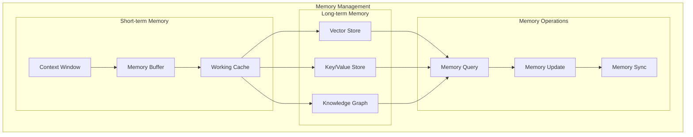
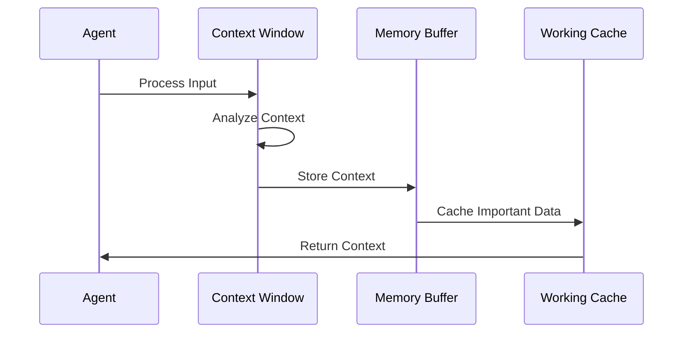
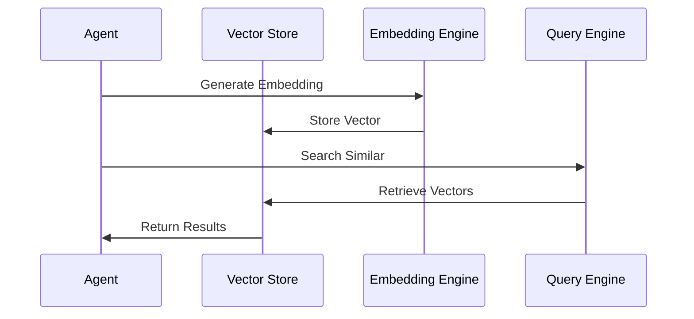
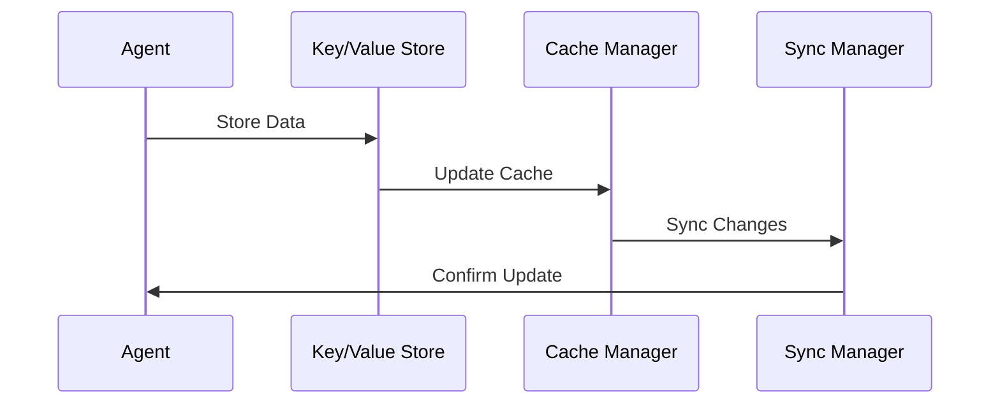
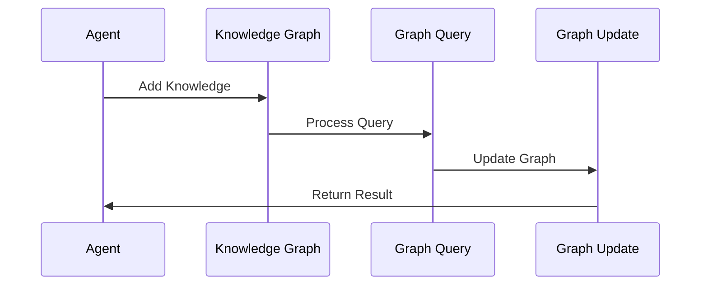
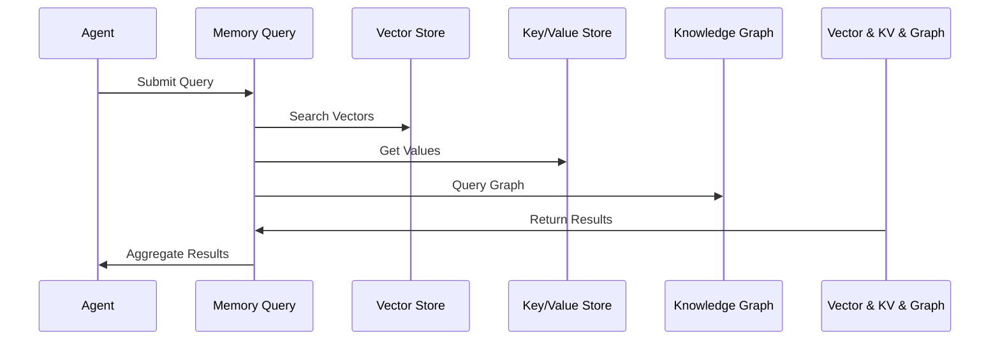
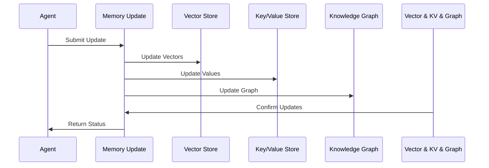
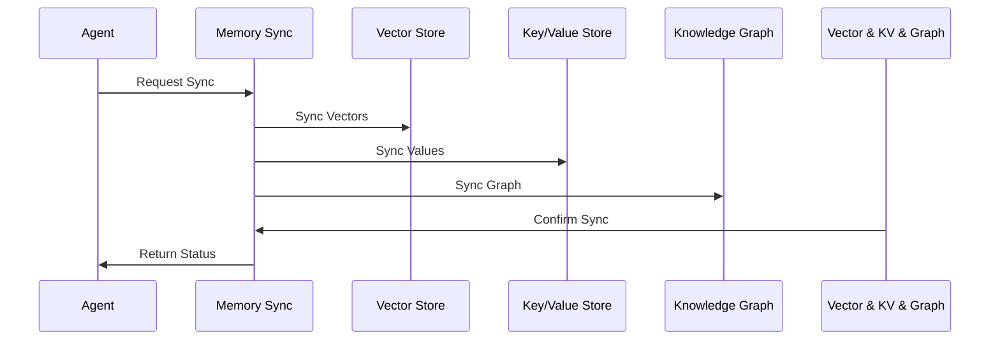

# Memory Management Implementation

## Overview
This document outlines the implementation of memory management systems for our agentic workflow, covering both short-term and long-term memory components.

## Memory Architecture

## Short-term Memory Implementation

### Context Window Management

#### Implementation Steps:
1. **Context Window**
   - Implement sliding window mechanism
   - Set context size limits
   - Handle context overflow

2. **Memory Buffer**
   - Implement buffer management
   - Handle buffer prioritization
   - Manage buffer cleanup

3. **Working Cache**
   - Implement cache policies
   - Handle cache invalidation
   - Manage cache size

## Long-term Memory Implementation

### Vector Store (Weaviate)

#### Implementation Steps:
1. **Vector Storage**
   - Set up Weaviate instance
   - Define schema
   - Implement CRUD operations

2. **Embedding Engine**
   - Implement embedding generation
   - Handle batch processing
   - Manage embedding updates

3. **Query Engine**
   - Implement similarity search
   - Handle query optimization
   - Manage result ranking

### Key/Value Store (Redis)

#### Implementation Steps:
1. **Data Storage**
   - Set up Redis instance
   - Define data structures
   - Implement storage policies

2. **Cache Management**
   - Implement cache strategies
   - Handle cache invalidation
   - Manage cache size

3. **Sync Management**
   - Implement sync mechanisms
   - Handle conflict resolution
   - Manage sync schedules

### Knowledge Graph (Neo4j)

#### Implementation Steps:
1. **Graph Structure**
   - Set up Neo4j instance
   - Define graph schema
   - Implement graph operations

2. **Query Processing**
   - Implement graph queries
   - Handle query optimization
   - Manage result processing

3. **Graph Updates**
   - Implement update operations
   - Handle consistency
   - Manage graph maintenance

## Memory Operations

### Query Operations

#### Implementation Steps:
1. **Query Processing**
   - Implement query parsing
   - Handle query routing
   - Manage result aggregation

2. **Result Management**
   - Implement result caching
   - Handle result ranking
   - Manage result updates

### Update Operations

#### Implementation Steps:
1. **Update Processing**
   - Implement update validation
   - Handle update routing
   - Manage update conflicts

2. **Consistency Management**
   - Implement consistency checks
   - Handle rollback operations
   - Manage update logs

### Sync Operations

#### Implementation Steps:
1. **Sync Processing**
   - Implement sync scheduling
   - Handle sync conflicts
   - Manage sync logs

2. **State Management**
   - Implement state tracking
   - Handle state recovery
   - Manage state transitions

## Implementation Timeline

### Phase 1: Foundation (Weeks 1-2)
1. Implement short-term memory
   - Context window
   - Memory buffer
   - Working cache

### Phase 2: Storage (Weeks 3-4)
1. Implement long-term memory
   - Vector store
   - Key/value store
   - Knowledge graph

### Phase 3: Operations (Weeks 5-6)
1. Implement memory operations
   - Query operations
   - Update operations
   - Sync operations

## Next Steps
1. Set up development environment
2. Create initial test cases
3. Implement basic components
4. Establish monitoring
5. Begin documentation
