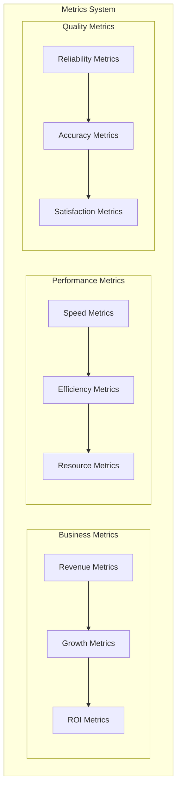
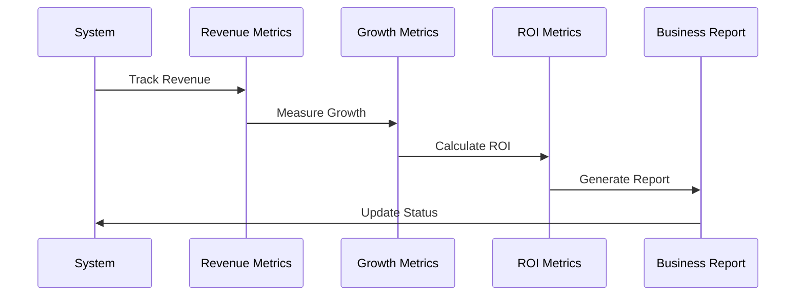
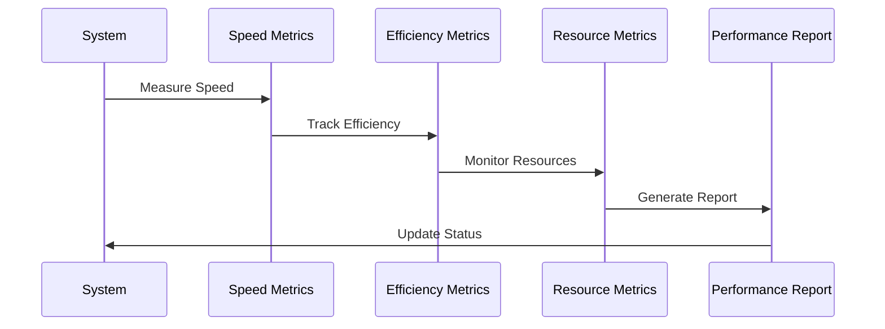
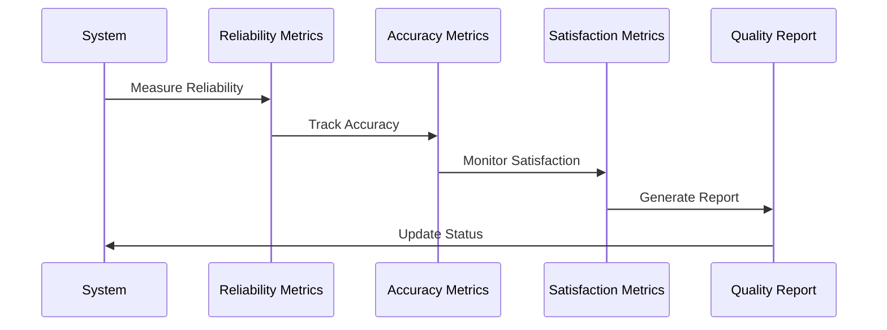
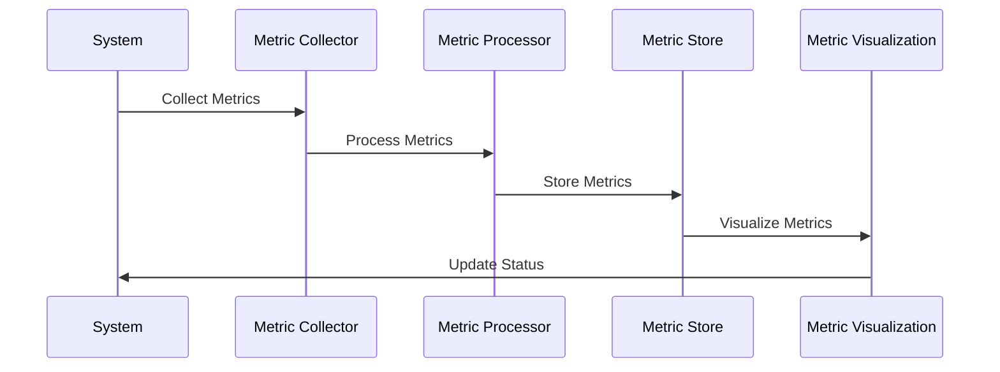
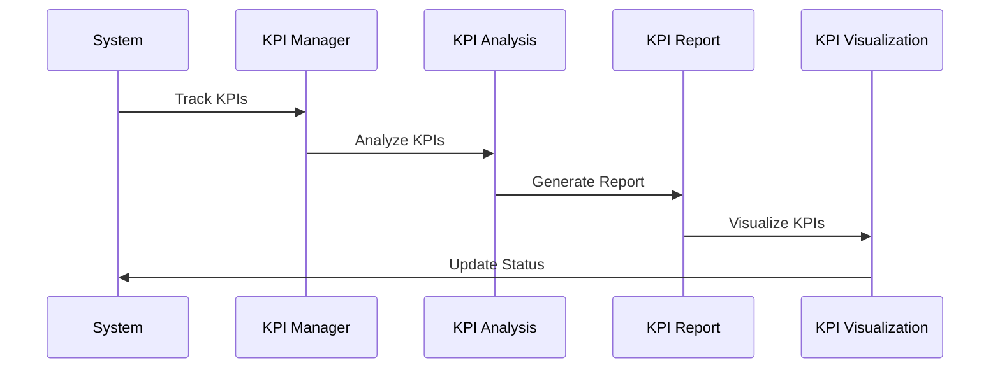

# Metrics and KPIs Implementation

## Overview
This document outlines the implementation of metrics and KPIs for our agentic workflow system, focusing on business metrics, performance indicators, and quality metrics.

## Metrics Architecture

## Implementation Details

### 1. Business Metrics

#### Implementation Steps:
1. **Revenue Metrics**
   - Track revenue
   - Measure growth
   - Calculate ROI

2. **Growth Metrics**
   - Monitor growth
   - Track progress
   - Measure success

3. **ROI Metrics**
   - Calculate ROI
   - Track investments
   - Measure returns

### 2. Performance Metrics

#### Implementation Steps:
1. **Speed Metrics**
   - Measure response time
   - Track processing speed
   - Monitor latency

2. **Efficiency Metrics**
   - Track resource usage
   - Measure throughput
   - Monitor utilization

3. **Resource Metrics**
   - Monitor resources
   - Track consumption
   - Measure efficiency

### 3. Quality Metrics

#### Implementation Steps:
1. **Reliability Metrics**
   - Measure uptime
   - Track errors
   - Monitor stability

2. **Accuracy Metrics**
   - Track accuracy
   - Measure precision
   - Monitor quality

3. **Satisfaction Metrics**
   - Monitor satisfaction
   - Track feedback
   - Measure quality

### 4. Metric Collection

#### Implementation Steps:
1. **Metric Collection**
   - Implement collection
   - Define metrics
   - Handle gathering

2. **Metric Processing**
   - Process metrics
   - Analyze data
   - Generate insights

3. **Metric Storage**
   - Store metrics
   - Manage data
   - Handle persistence

### 5. KPI Reporting

#### Implementation Steps:
1. **KPI Management**
   - Track KPIs
   - Monitor progress
   - Measure success

2. **KPI Analysis**
   - Analyze KPIs
   - Generate insights
   - Track trends

3. **KPI Reporting**
   - Generate reports
   - Visualize data
   - Share insights

## Implementation Timeline

### Phase 1: Foundation (Weeks 1-2)
1. Implement Business Metrics
   - Revenue metrics
   - Growth metrics
   - ROI metrics

### Phase 2: Performance (Weeks 3-4)
1. Implement Performance Metrics
   - Speed metrics
   - Efficiency metrics
   - Resource metrics

### Phase 3: Quality (Weeks 5-6)
1. Implement Quality Metrics
   - Reliability metrics
   - Accuracy metrics
   - Satisfaction metrics

### Phase 4: Integration (Weeks 7-8)
1. Implement Integration
   - Metric collection
   - KPI reporting
   - System integration

## Next Steps
1. Set up metrics environment
2. Create initial metrics
3. Implement basic tracking
4. Establish reporting
5. Begin documentation
