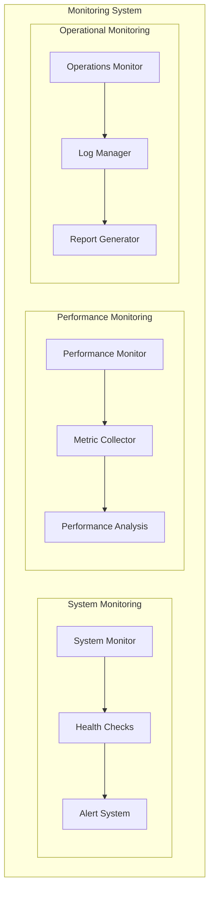
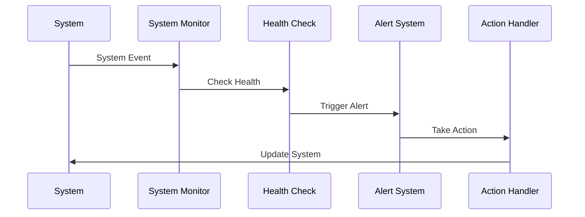
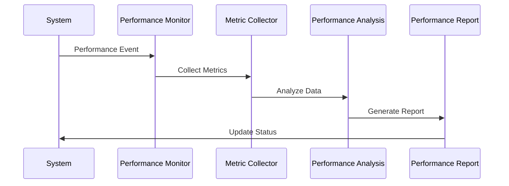
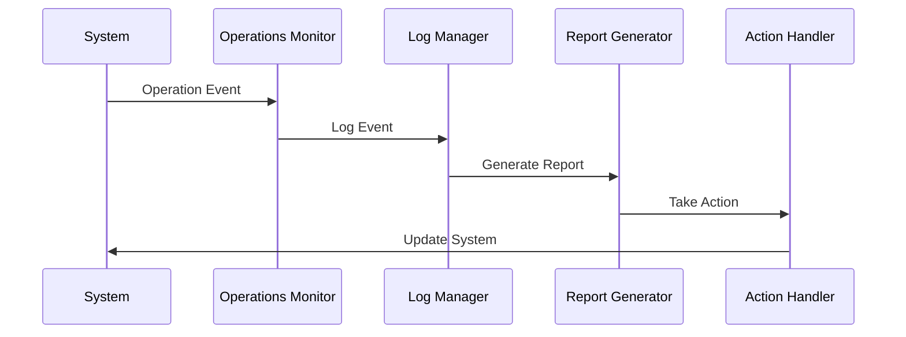
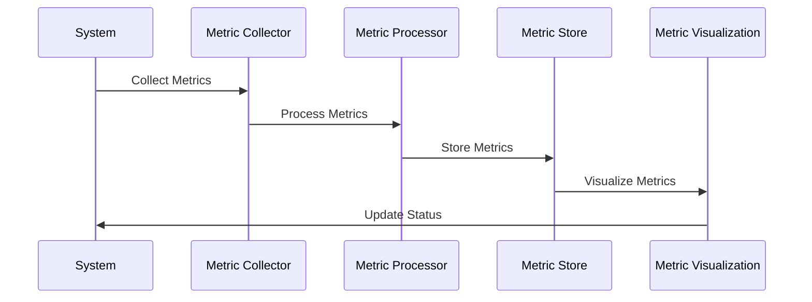
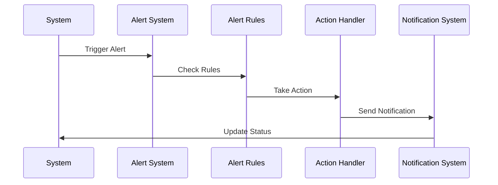

# Monitoring and Metrics Implementation

## Overview
This document outlines the implementation of monitoring and metrics for our agentic workflow system, focusing on system monitoring, performance metrics, and operational insights.

## Monitoring Architecture

## Implementation Details

### 1. System Monitoring

#### Implementation Steps:
1. **System Monitor**
   - Implement monitoring system
   - Define monitoring rules
   - Handle system events

2. **Health Checks**
   - Implement health checks
   - Define health rules
   - Handle health status

3. **Alert System**
   - Implement alert system
   - Define alert rules
   - Handle alert actions

### 2. Performance Monitoring

#### Implementation Steps:
1. **Performance Monitor**
   - Implement performance monitoring
   - Define performance metrics
   - Handle performance events

2. **Metric Collector**
   - Implement metric collection
   - Define metric types
   - Handle metric storage

3. **Performance Analysis**
   - Implement analysis system
   - Define analysis rules
   - Handle performance insights

### 3. Operational Monitoring

#### Implementation Steps:
1. **Operations Monitor**
   - Implement operations monitoring
   - Define operation metrics
   - Handle operation events

2. **Log Manager**
   - Implement logging system
   - Define log levels
   - Handle log storage

3. **Report Generator**
   - Implement reporting system
   - Define report formats
   - Handle report generation

### 4. Metric Collection

#### Implementation Steps:
1. **Metric Collector**
   - Implement collection system
   - Define collection rules
   - Handle metric gathering

2. **Metric Processor**
   - Implement processing system
   - Define processing rules
   - Handle metric analysis

3. **Metric Store**
   - Implement storage system
   - Define storage rules
   - Handle metric persistence

### 5. Alert Management

#### Implementation Steps:
1. **Alert System**
   - Implement alert system
   - Define alert types
   - Handle alert triggers

2. **Alert Rules**
   - Implement rule system
   - Define rule types
   - Handle rule evaluation

3. **Action Handler**
   - Implement action system
   - Define action types
   - Handle action execution

## Implementation Timeline

### Phase 1: Foundation (Weeks 1-2)
1. Implement System Monitoring
   - System Monitor
   - Health Checks
   - Alert System

### Phase 2: Performance (Weeks 3-4)
1. Implement Performance Monitoring
   - Performance Monitor
   - Metric Collector
   - Performance Analysis

### Phase 3: Operations (Weeks 5-6)
1. Implement Operational Monitoring
   - Operations Monitor
   - Log Manager
   - Report Generator

### Phase 4: Integration (Weeks 7-8)
1. Implement Integration
   - Metric Collection
   - Alert Management
   - System Integration

## Next Steps
1. Set up monitoring environment
2. Create initial metrics
3. Implement basic monitoring
4. Establish alerting
5. Begin documentation 