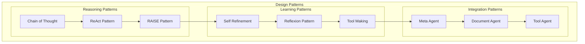
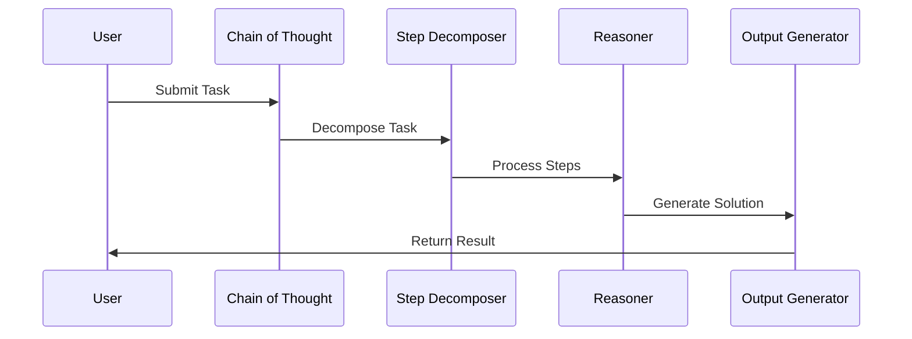
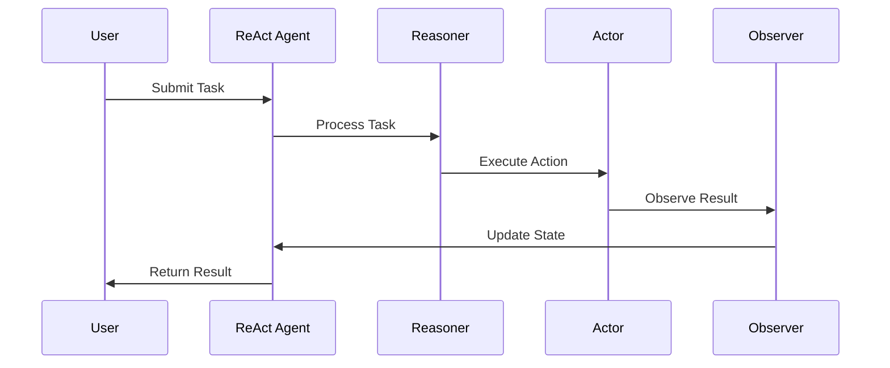
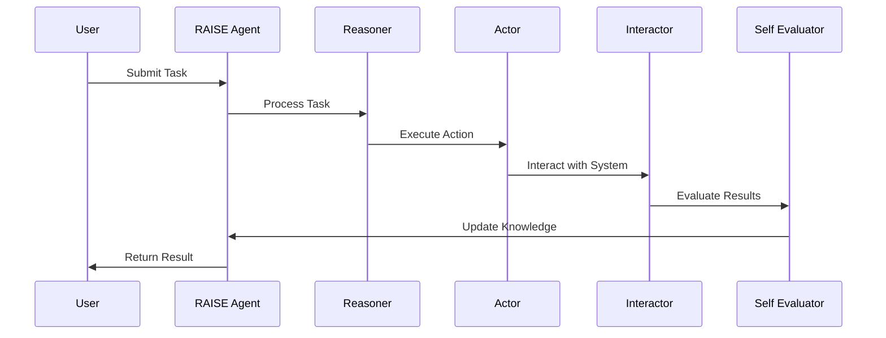
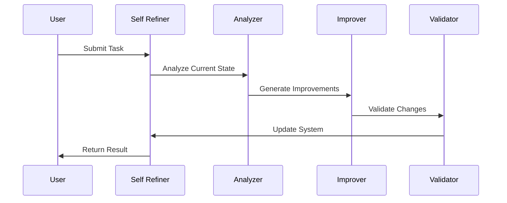
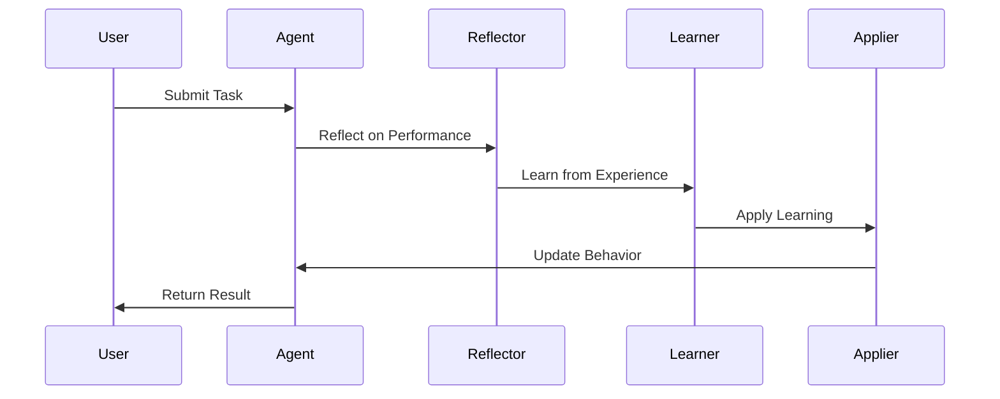
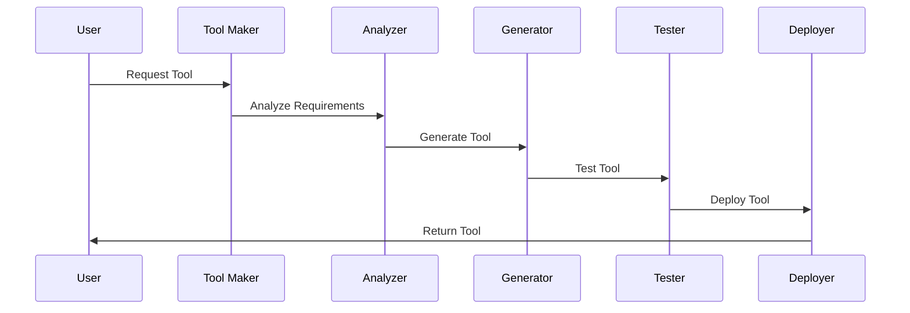

# Design Patterns and Strategies Implementation

## Overview
This document outlines the implementation of various design patterns and strategies for our agentic workflow system.

## Design Patterns Architecture

## Implementation Details

### 1. Chain of Thought (CoT)

#### Implementation Steps:
1. **Task Decomposition**
   - Implement step decomposition
   - Define step relationships
   - Handle step dependencies

2. **Reasoning Process**
   - Implement reasoning logic
   - Define reasoning rules
   - Handle reasoning paths

3. **Solution Generation**
   - Implement solution templates
   - Define output formats
   - Handle solution validation

### 2. ReAct Pattern

#### Implementation Steps:
1. **Reasoning Component**
   - Implement reasoning engine
   - Define reasoning rules
   - Handle reasoning states

2. **Action Component**
   - Implement action executor
   - Define action rules
   - Handle action results

3. **Observation Component**
   - Implement observation system
   - Define observation rules
   - Handle observation results

### 3. RAISE Pattern

#### Implementation Steps:
1. **Reasoning Component**
   - Implement reasoning engine
   - Define reasoning rules
   - Handle reasoning states

2. **Action Component**
   - Implement action executor
   - Define action rules
   - Handle action results

3. **Interaction Component**
   - Implement interaction system
   - Define interaction rules
   - Handle interaction results

4. **Self-Evaluation**
   - Implement evaluation system
   - Define evaluation rules
   - Handle evaluation results

### 4. Self Refinement

#### Implementation Steps:
1. **Analysis Component**
   - Implement analysis engine
   - Define analysis rules
   - Handle analysis results

2. **Improvement Component**
   - Implement improvement generator
   - Define improvement rules
   - Handle improvement results

3. **Validation Component**
   - Implement validation system
   - Define validation rules
   - Handle validation results

### 5. Reflexion Pattern

#### Implementation Steps:
1. **Reflection Component**
   - Implement reflection engine
   - Define reflection rules
   - Handle reflection results

2. **Learning Component**
   - Implement learning system
   - Define learning rules
   - Handle learning results

3. **Application Component**
   - Implement application system
   - Define application rules
   - Handle application results

### 6. LATM (LLMs as Tool Makers)

#### Implementation Steps:
1. **Analysis Component**
   - Implement requirement analyzer
   - Define analysis rules
   - Handle analysis results

2. **Generation Component**
   - Implement tool generator
   - Define generation rules
   - Handle generation results

3. **Testing Component**
   - Implement testing system
   - Define testing rules
   - Handle testing results

4. **Deployment Component**
   - Implement deployment system
   - Define deployment rules
   - Handle deployment results

## Implementation Timeline

### Phase 1: Foundation (Weeks 1-2)
1. Implement basic patterns
   - Chain of Thought
   - Basic ReAct
   - Simple RAISE

### Phase 2: Enhancement (Weeks 3-4)
1. Implement advanced patterns
   - Self Refinement
   - Reflexion
   - Advanced RAISE

### Phase 3: Autonomy (Weeks 5-6)
1. Implement autonomous patterns
   - LATM
   - Meta Agent
   - Document Agent

## Next Steps
1. Set up development environment
2. Create initial test cases
3. Implement basic patterns
4. Establish monitoring
5. Begin documentation 