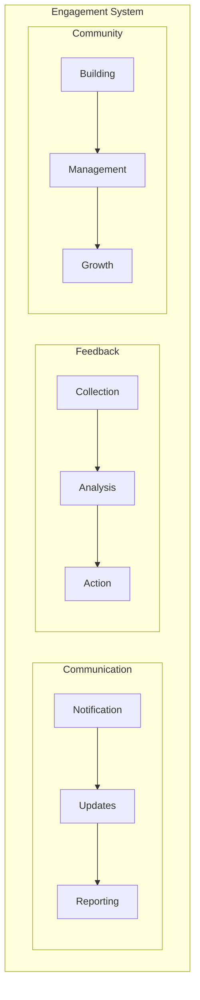
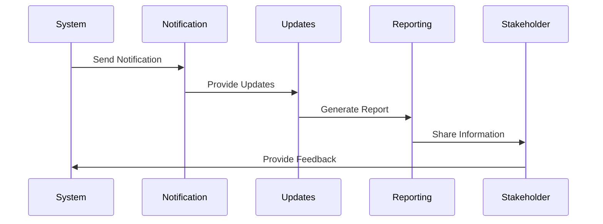
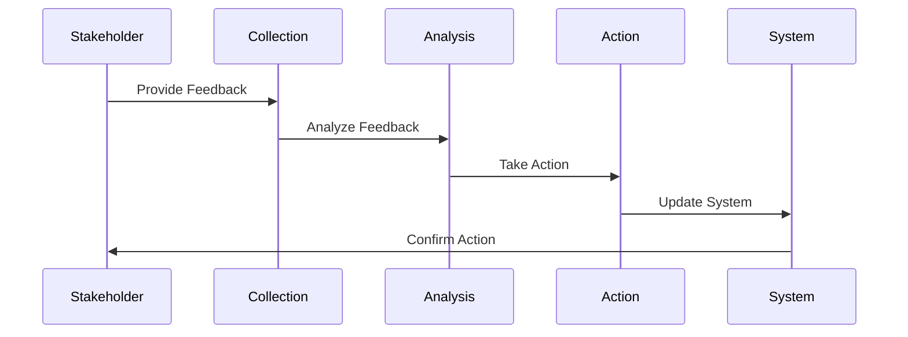
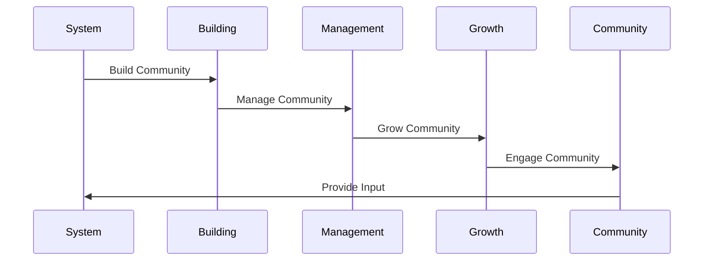
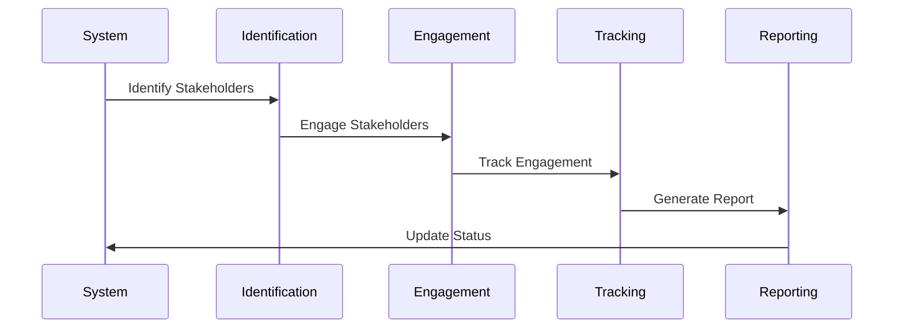
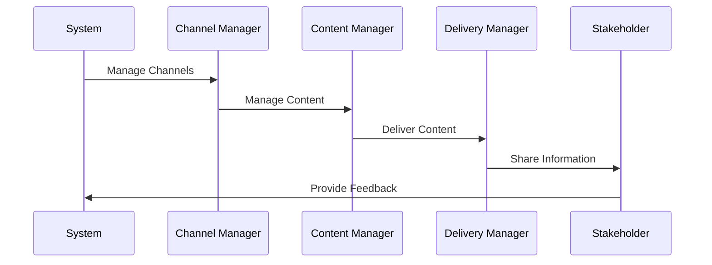

# Stakeholder Engagement Implementation

## Overview
This document outlines the implementation of stakeholder engagement strategies for our agentic workflow system, focusing on communication, feedback collection, and community building.

## Engagement Architecture

## Implementation Details

### 1. Communication Strategy

#### Implementation Steps:
1. **Notification System**
   - Implement notifications
   - Define notification types
   - Handle delivery

2. **Update Management**
   - Manage updates
   - Track changes
   - Share information

3. **Reporting System**
   - Generate reports
   - Share insights
   - Track engagement

### 2. Feedback Collection

#### Implementation Steps:
1. **Feedback Collection**
   - Collect feedback
   - Track responses
   - Manage input

2. **Feedback Analysis**
   - Analyze feedback
   - Generate insights
   - Track trends

3. **Action Management**
   - Plan actions
   - Implement changes
   - Track progress

### 3. Community Building

#### Implementation Steps:
1. **Community Building**
   - Build community
   - Define structure
   - Set guidelines

2. **Community Management**
   - Manage community
   - Handle interactions
   - Track engagement

3. **Community Growth**
   - Grow community
   - Track growth
   - Measure success

### 4. Stakeholder Management

#### Implementation Steps:
1. **Stakeholder Identification**
   - Identify stakeholders
   - Define roles
   - Set expectations

2. **Stakeholder Engagement**
   - Engage stakeholders
   - Manage relationships
   - Track interactions

3. **Engagement Tracking**
   - Track engagement
   - Measure success
   - Generate reports

### 5. Communication Channels

#### Implementation Steps:
1. **Channel Management**
   - Manage channels
   - Define channels
   - Track usage

2. **Content Management**
   - Manage content
   - Create content
   - Track content

3. **Delivery Management**
   - Manage delivery
   - Track delivery
   - Handle feedback

## Implementation Timeline

### Phase 1: Foundation (Weeks 1-2)
1. Implement Communication Strategy
   - Notification system
   - Update management
   - Reporting system

### Phase 2: Feedback (Weeks 3-4)
1. Implement Feedback Collection
   - Feedback collection
   - Feedback analysis
   - Action management

### Phase 3: Community (Weeks 5-6)
1. Implement Community Building
   - Community building
   - Community management
   - Community growth

### Phase 4: Integration (Weeks 7-8)
1. Implement Integration
   - Stakeholder management
   - Communication channels
   - System integration

## Next Steps
1. Set up engagement environment
2. Create initial strategies
3. Implement basic systems
4. Establish channels
5. Begin documentation
