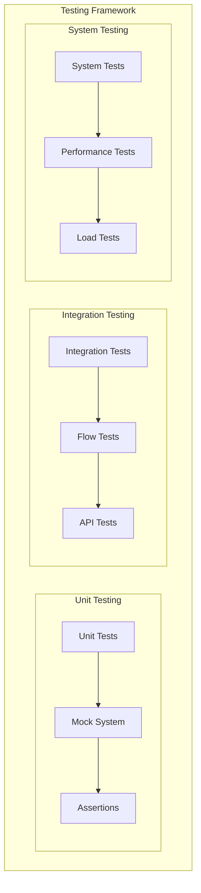
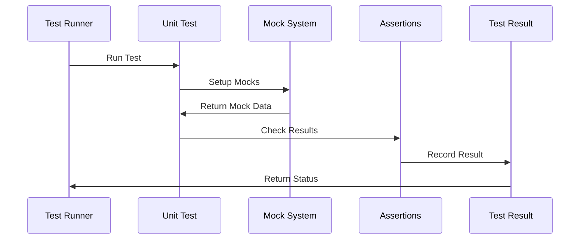
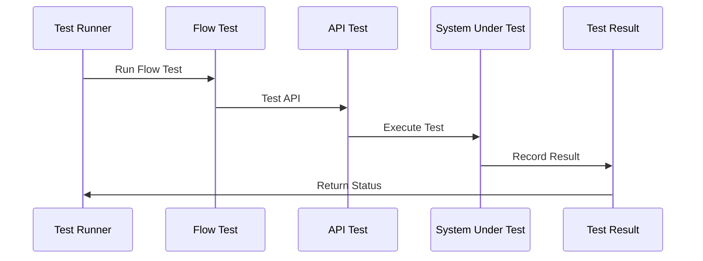
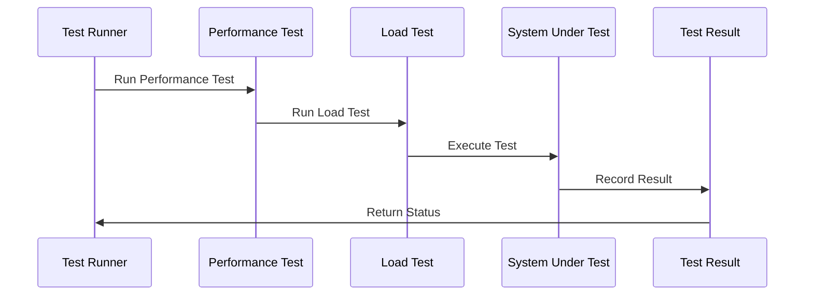
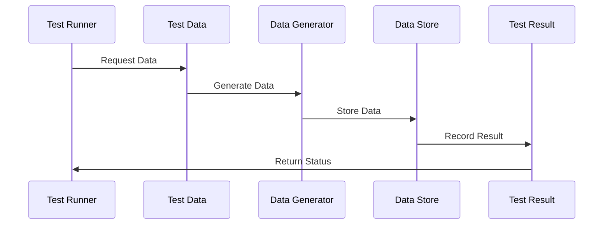
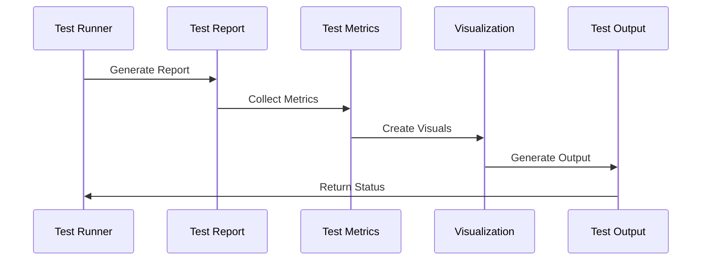

# Testing Strategies Implementation

## Overview
This document outlines the implementation of testing strategies for our agentic workflow system, focusing on unit testing, integration testing, and system testing.

## Testing Architecture

## Implementation Details

### 1. Unit Testing

#### Implementation Steps:
1. **Test Runner**
   - Implement test runner
   - Define test cases
   - Handle test execution

2. **Mock System**
   - Implement mock system
   - Define mock data
   - Handle mock responses

3. **Assertions**
   - Implement assertions
   - Define assertion rules
   - Handle test validation

### 2. Integration Testing

#### Implementation Steps:
1. **Flow Testing**
   - Implement flow tests
   - Define flow scenarios
   - Handle flow validation

2. **API Testing**
   - Implement API tests
   - Define API scenarios
   - Handle API validation

3. **System Testing**
   - Implement system tests
   - Define system scenarios
   - Handle system validation

### 3. System Testing

#### Implementation Steps:
1. **Performance Testing**
   - Implement performance tests
   - Define performance metrics
   - Handle performance validation

2. **Load Testing**
   - Implement load tests
   - Define load scenarios
   - Handle load validation

3. **System Validation**
   - Implement system validation
   - Define validation rules
   - Handle system checks

### 4. Test Data Management

#### Implementation Steps:
1. **Test Data**
   - Implement data system
   - Define data types
   - Handle data management

2. **Data Generator**
   - Implement generator
   - Define generation rules
   - Handle data creation

3. **Data Store**
   - Implement storage
   - Define storage rules
   - Handle data persistence

### 5. Test Reporting

#### Implementation Steps:
1. **Test Report**
   - Implement reporting
   - Define report format
   - Handle report generation

2. **Test Metrics**
   - Implement metrics
   - Define metric types
   - Handle metric collection

3. **Visualization**
   - Implement visualization
   - Define visual types
   - Handle visual generation

## Implementation Timeline

### Phase 1: Foundation (Weeks 1-2)
1. Implement Unit Testing
   - Test Runner
   - Mock System
   - Assertions

### Phase 2: Integration (Weeks 3-4)
1. Implement Integration Testing
   - Flow Testing
   - API Testing
   - System Testing

### Phase 3: System (Weeks 5-6)
1. Implement System Testing
   - Performance Testing
   - Load Testing
   - System Validation

### Phase 4: Operations (Weeks 7-8)
1. Implement Operations
   - Test Data Management
   - Test Reporting
   - Test Automation

## Next Steps
1. Set up testing environment
2. Create initial test cases
3. Implement basic tests
4. Establish reporting
5. Begin documentation 