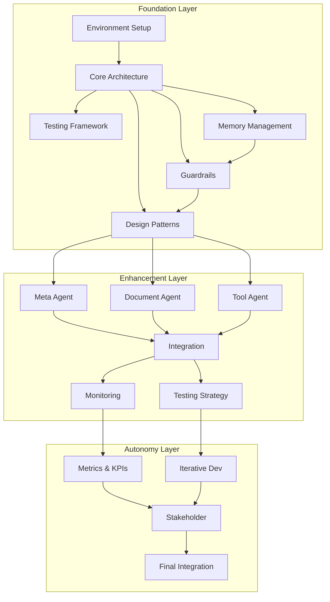

# Implementation Dependencies

## Overview
This document outlines the dependencies between different components of the agentic workflow system and links to their detailed implementation plans.

## Component Dependencies

## Document Links

### Foundation Layer
1. **Environment Setup**
   - [Implementation Guide](implementation-guide.md)
   - [Tools and Technologies](tools-and-technologies.md)

2. **Core Architecture**
   - [Architecture Design](architecture-design.md)
   - [Component Relationships](component-relationships.md)
   - [Architecture Component Mapping](architecture-component-mapping.md)

3. **Memory Management**
   - [Memory Management Implementation](memory-management.md)
   - Dependencies:
     - Vector Store (Weaviate)
     - Key/Value Store (Redis)
     - Knowledge Graph (Neo4j)

4. **Guardrails and Error Handling**
   - [Guardrails Implementation](guardrails-error-handling.md)
   - Dependencies:
     - Input Validation
     - Process Guardrails
     - Error Handling

5. **Design Patterns**
   - [Design Patterns Implementation](design-patterns.md)
   - Dependencies:
     - Reasoning Patterns
     - Learning Patterns
     - Integration Patterns

### Enhancement Layer
1. **Emerging Architectures**
   - [Emerging Architectures Implementation](emerging-architectures.md)
   - Dependencies:
     - Meta Agent
     - Document Agent
     - Tool Agent

2. **Integration Strategies**
   - [Integration Strategies Implementation](integration-strategies.md)
   - Dependencies:
     - Component Integration
     - Data Integration
     - System Integration

3. **Testing Strategies**
   - [Testing Strategies Implementation](testing-strategies.md)
   - Dependencies:
     - Unit Testing
     - Integration Testing
     - System Testing

4. **Monitoring and Metrics**
   - [Monitoring Implementation](monitoring-metrics.md)
   - Dependencies:
     - System Monitoring
     - Performance Monitoring
     - Operational Monitoring

### Autonomy Layer
1. **Metrics and KPIs**
   - [Metrics Implementation](metrics-and-kpis.md)
   - Dependencies:
     - Business Metrics
     - Performance Metrics
     - Quality Metrics

2. **Iterative Development**
   - [Iterative Development Implementation](iterative-development.md)
   - Dependencies:
     - Development Cycles
     - Feedback Loops
     - Version Control

3. **Stakeholder Engagement**
   - [Stakeholder Engagement Implementation](stakeholder-engagement.md)
   - Dependencies:
     - Communication Strategy
     - Feedback Collection
     - Community Building

## Critical Path

## Implementation Order

1. **Foundation Layer (Weeks 1-4)**
   - Environment Setup (Week 1)
   - Core Architecture (Week 1)
   - Memory Management (Week 2)
   - Guardrails (Week 3)
   - Design Patterns (Week 4)

2. **Enhancement Layer (Weeks 5-8)**
   - Emerging Architectures (Week 5)
   - Integration Strategies (Week 6)
   - Testing Strategies (Week 7)
   - Monitoring (Week 8)

3. **Autonomy Layer (Weeks 9-12)**
   - Metrics and KPIs (Week 9)
   - Iterative Development (Week 10)
   - Stakeholder Engagement (Week 11)
   - Final Integration (Week 12)

## Dependencies by Phase

### Phase 1 Dependencies
- Environment Setup → Core Architecture
- Core Architecture → Memory Management
- Memory Management → Guardrails
- Guardrails → Design Patterns

### Phase 2 Dependencies
- Design Patterns → Emerging Architectures
- Emerging Architectures → Integration
- Integration → Testing
- Testing → Monitoring

### Phase 3 Dependencies
- Monitoring → Metrics
- Metrics → Iterative Development
- Iterative Development → Stakeholder Engagement
- Stakeholder Engagement → Final Integration

## Risk Assessment

### High-Risk Dependencies
1. Memory Management → Guardrails
   - Risk: Data consistency issues
   - Mitigation: Implement robust validation

2. Design Patterns → Emerging Architectures
   - Risk: Integration complexity
   - Mitigation: Thorough testing and validation

3. Integration → Testing
   - Risk: System-wide failures
   - Mitigation: Incremental integration

### Medium-Risk Dependencies
1. Core Architecture → Memory Management
   - Risk: Performance bottlenecks
   - Mitigation: Performance testing

2. Emerging Architectures → Integration
   - Risk: Communication issues
   - Mitigation: Clear interfaces

### Low-Risk Dependencies
1. Environment Setup → Core Architecture
   - Risk: Configuration issues
   - Mitigation: Documentation

2. Testing → Monitoring
   - Risk: Coverage gaps
   - Mitigation: Comprehensive testing 