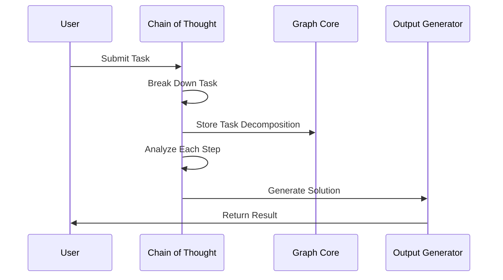
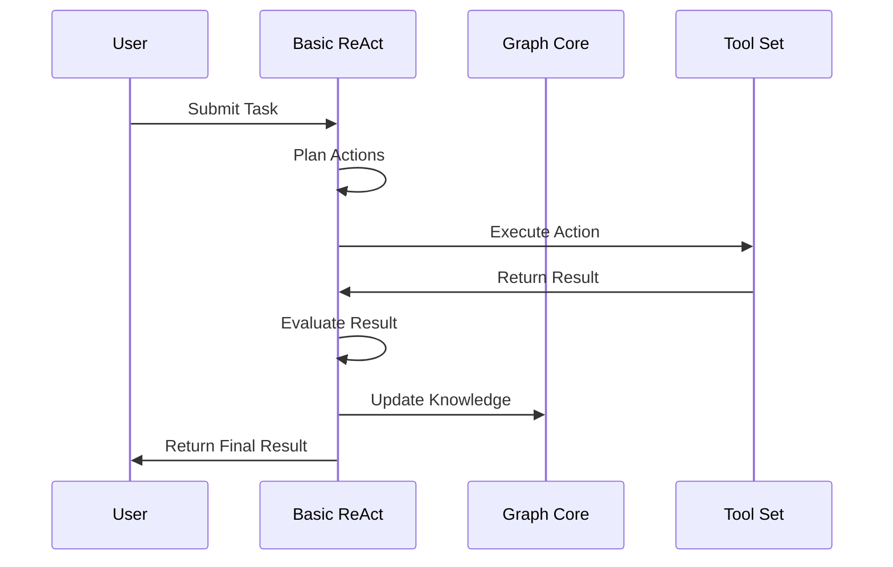
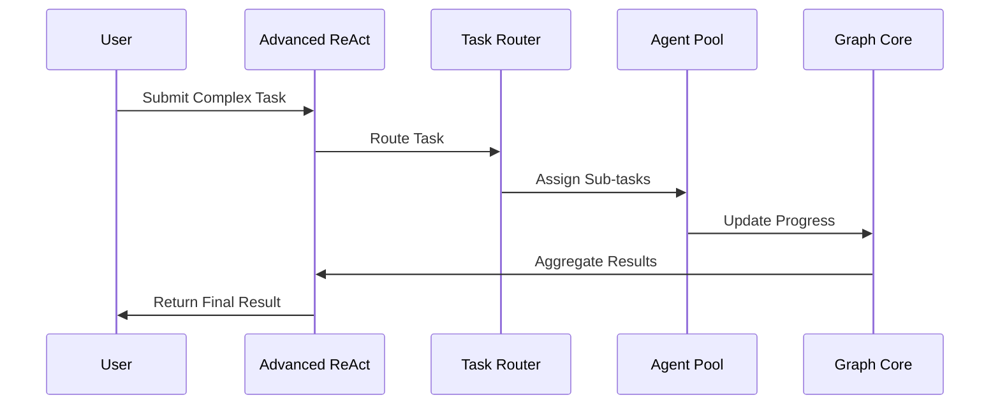
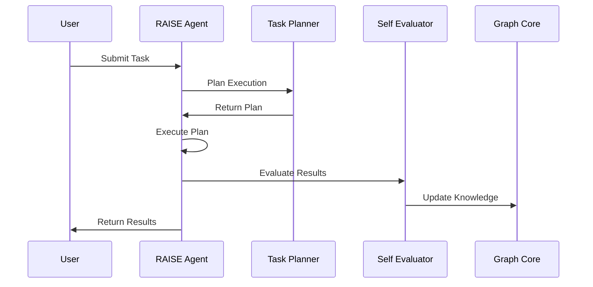
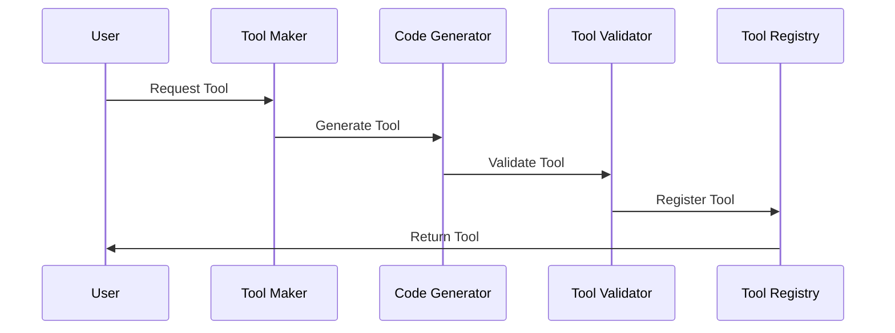
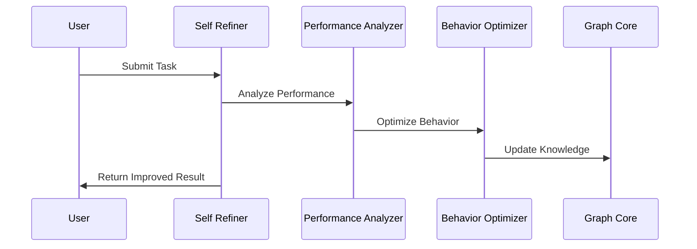

# Implementation Plan

## Level 1: AI Workflows (Output Decisions)

### Chain of Thought (CoT) Implementation

#### Implementation Steps:
1. **Task Decomposition**
   - Implement NLP-based task analysis
   - Create task graph structure in Neo4j
   - Store task relationships and dependencies

2. **Reasoning Engine**
   - Implement step-by-step reasoning
   - Store reasoning paths in Weaviate
   - Validate reasoning using NetworkX

3. **Output Generation**
   - Implement solution templates
   - Generate code/documentation
   - Validate outputs

### Basic ReAct Implementation

#### Implementation Steps:
1. **Action Planning**
   - Implement action selection logic
   - Create action templates
   - Store action history

2. **Tool Integration**
   - Implement tool interfaces
   - Create tool registry
   - Handle tool execution

3. **Result Evaluation**
   - Implement evaluation metrics
   - Store evaluation results
   - Update knowledge base

## Level 2: Router Workflows (Task Decisions)

### Advanced ReAct Implementation

#### Implementation Steps:
1. **Task Routing**
   - Implement routing logic
   - Create task queues
   - Handle task prioritization

2. **Agent Management**
   - Implement agent pool
   - Create agent selection logic
   - Handle agent coordination

3. **Progress Tracking**
   - Implement progress monitoring
   - Create status updates
   - Handle task completion

### RAISE Implementation

#### Implementation Steps:
1. **Task Planning**
   - Implement planning algorithms
   - Create plan templates
   - Store plan history

2. **Self-Evaluation**
   - Implement evaluation metrics
   - Create improvement strategies
   - Store evaluation results

3. **Knowledge Management**
   - Implement knowledge updates
   - Create learning mechanisms
   - Store learned patterns

## Level 3: Autonomous Agents (Process Decisions)

### Tool Maker Implementation

#### Implementation Steps:
1. **Tool Generation**
   - Implement code generation
   - Create tool templates
   - Handle tool dependencies

2. **Tool Validation**
   - Implement validation rules
   - Create test cases
   - Handle validation results

3. **Tool Management**
   - Implement tool registry
   - Create version control
   - Handle tool updates

### Self Refiner Implementation

#### Implementation Steps:
1. **Performance Analysis**
   - Implement analysis metrics
   - Create performance baselines
   - Store analysis results

2. **Behavior Optimization**
   - Implement optimization algorithms
   - Create improvement strategies
   - Handle optimization results

3. **Knowledge Updates**
   - Implement knowledge management
   - Create learning mechanisms
   - Store learned patterns

## Implementation Timeline

### Phase 1: Foundation (Weeks 1-4)
1. Implement Level 1 components
   - Chain of Thought
   - Basic ReAct
   - Graph Core integration

### Phase 2: Enhancement (Weeks 5-8)
1. Implement Level 2 components
   - Advanced ReAct
   - RAISE
   - Task routing

### Phase 3: Autonomy (Weeks 9-12)
1. Implement Level 3 components
   - Tool Maker
   - Self Refiner
   - Autonomous capabilities

## Next Steps
1. Set up development environment
2. Create initial test cases
3. Implement basic components
4. Establish monitoring
5. Begin documentation
