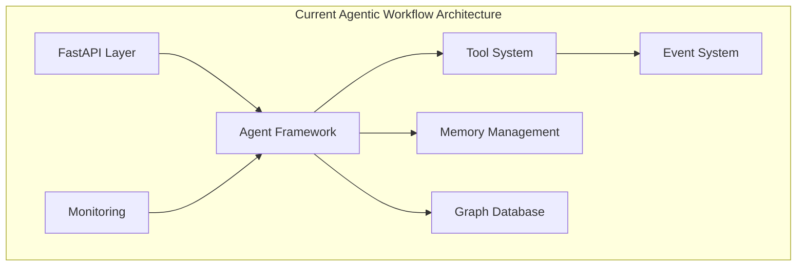
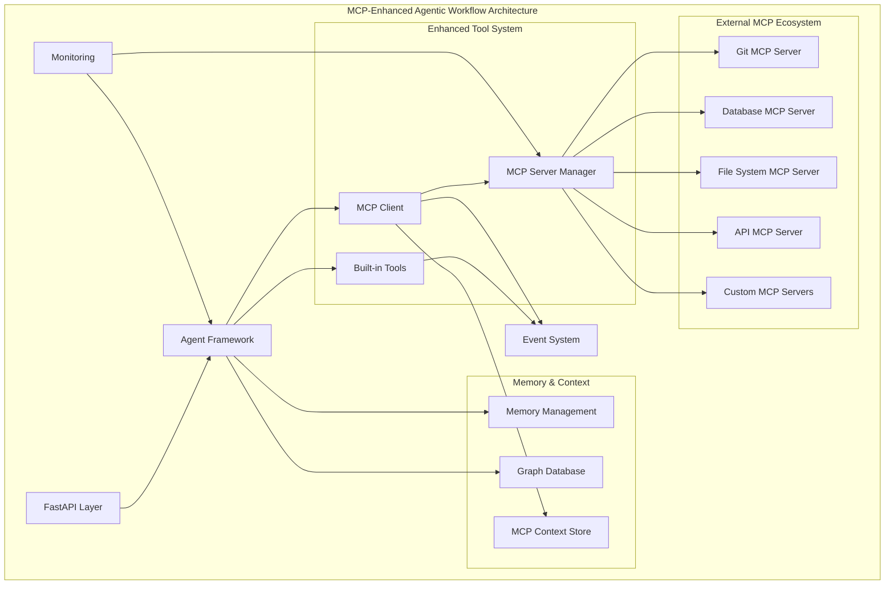
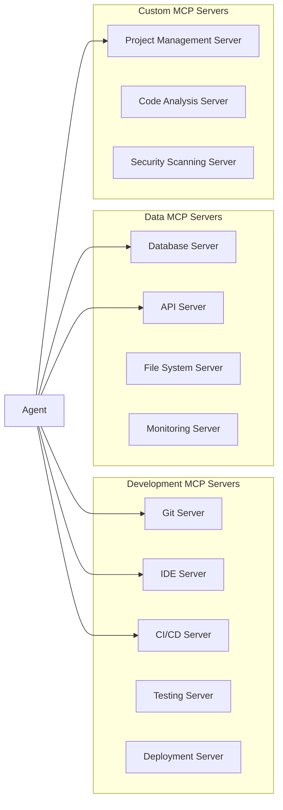

# MCP Architecture Integration

## Overview

This document outlines how the Model Context Protocol (MCP) integrates with the existing agentic workflow architecture, creating a dynamic, extensible system that maintains all current capabilities while adding runtime adaptability.

## Current Architecture Analysis

### Existing System Components



**Current Strengths:**
- ✅ Advanced reasoning patterns (Chain of Thought, ReAct)
- ✅ Dynamic tool discovery and execution
- ✅ Comprehensive memory management (Redis, Weaviate, Neo4j)
- ✅ Agent coordination and planning capabilities
- ✅ Event-driven architecture with MQTT
- ✅ Monitoring and observability with Prometheus

**Current Limitations:**
- ❌ Tools are limited to pre-built, static implementations
- ❌ No runtime capability discovery from external sources
- ❌ Limited access to live external data sources
- ❌ Static integration with external development tools

## MCP-Enhanced Architecture

### Integrated Architecture Design



## Integration Layers

### 1. MCP Client Layer

**Purpose**: Manages connections to MCP servers and provides a unified interface for agents.

```python
class MCPClient:
    """
    Central MCP client for the agentic workflow system.
    
    Responsibilities:
    - Discover and connect to MCP servers
    - Provide unified interface for agents
    - Handle authentication and authorization
    - Cache capabilities and resources
    - Manage connection lifecycle
    """
    
    async def discover_servers(self) -> List[MCPServer]:
        """Discover available MCP servers."""
        
    async def get_capabilities(self, server_id: str) -> MCPCapabilities:
        """Get capabilities from a specific server."""
        
    async def execute_tool(self, server_id: str, tool_name: str, params: dict) -> Any:
        """Execute a tool on an MCP server."""
        
    async def get_resource(self, server_id: str, resource_uri: str) -> Any:
        """Retrieve a resource from an MCP server."""
```

### 2. Enhanced Agent Framework

**Integration Points**: Existing agents gain MCP awareness without breaking changes.

```python
class MCPEnhancedAgent(Agent):
    """
    Enhanced agent with MCP capabilities.
    
    Maintains all existing functionality while adding:
    - Dynamic capability discovery
    - Real-time data access
    - External tool integration
    """
    
    def __init__(self, agent_id: str, mcp_client: MCPClient = None):
        super().__init__(agent_id)
        self.mcp_client = mcp_client or get_default_mcp_client()
        
    async def discover_capabilities(self) -> Dict[str, Any]:
        """Discover available capabilities from MCP servers."""
        builtin_capabilities = await super().get_capabilities()
        mcp_capabilities = await self.mcp_client.discover_capabilities()
        return {**builtin_capabilities, **mcp_capabilities}
        
    async def execute_with_mcp(self, task: AgentTask) -> AgentResult:
        """Execute task with both built-in and MCP tools."""
        # Use reasoning patterns to determine best tool mix
        reasoning_result = await self.reason_about_tools(task)
        
        # Execute using optimal combination of built-in and MCP tools
        return await self.execute_optimal_strategy(task, reasoning_result)
```

### 3. Tool System Enhancement

**Backward Compatibility**: All existing tools continue to work unchanged.

```python
class EnhancedToolManager:
    """
    Enhanced tool manager that combines built-in tools with MCP capabilities.
    """
    
    def __init__(self, mcp_client: MCPClient):
        self.builtin_tools = BuiltinToolRegistry()
        self.mcp_client = mcp_client
        
    async def discover_tools(self) -> List[Tool]:
        """Discover all available tools (built-in + MCP)."""
        builtin = await self.builtin_tools.list_tools()
        mcp_tools = await self.mcp_client.discover_tools()
        return builtin + mcp_tools
        
    async def execute_tool(self, tool_id: str, params: dict) -> ToolResult:
        """Execute tool from any source."""
        if self.builtin_tools.has_tool(tool_id):
            return await self.builtin_tools.execute(tool_id, params)
        else:
            return await self.mcp_client.execute_tool(tool_id, params)
```

### 4. Memory and Context Integration

**Enhanced Context Management**: MCP resources and capabilities are cached and indexed.

```python
class MCPContextStore:
    """
    Stores MCP server capabilities, resources, and execution history.
    """
    
    async def cache_server_capabilities(self, server_id: str, capabilities: dict):
        """Cache server capabilities for fast access."""
        
    async def store_resource_metadata(self, resource_uri: str, metadata: dict):
        """Store metadata about MCP resources."""
        
    async def track_tool_usage(self, tool_id: str, execution_data: dict):
        """Track MCP tool usage for optimization."""
```

## Integration Patterns

### 1. Reasoning Pattern Enhancement

**Chain of Thought with MCP**:
```python
async def enhanced_chain_of_thought(self, objective: str) -> ReasoningPath:
    """
    Chain of Thought reasoning with MCP-aware capability assessment.
    """
    # Step 1: Understand objective
    analysis = await self.analyze_objective(objective)
    
    # Step 2: Discover available capabilities (built-in + MCP)
    capabilities = await self.discover_all_capabilities()
    
    # Step 3: Reason through approach with full capability awareness
    reasoning_steps = await self.reason_with_capabilities(analysis, capabilities)
    
    # Step 4: Include real-time context from MCP resources
    context = await self.gather_mcp_context(reasoning_steps)
    
    # Step 5: Finalize reasoning path with complete information
    return await self.finalize_reasoning_path(reasoning_steps, context)
```

**ReAct Pattern with MCP**:
```python
async def enhanced_react_cycle(self, objective: str) -> ReasoningPath:
    """
    ReAct (Reasoning + Acting) with MCP tool integration.
    """
    reasoning_path = ReasoningPath(objective)
    
    while not reasoning_path.is_complete():
        # Reason about next action (with MCP capabilities)
        reasoning = await self.reason_next_action(
            objective, 
            reasoning_path.history,
            await self.discover_all_capabilities()
        )
        
        # Act using best available tool (built-in or MCP)
        action_result = await self.execute_optimal_action(reasoning.action)
        
        # Observe results and update context
        observation = await self.observe_and_contextualize(
            action_result,
            reasoning_path.context
        )
        
        # Update reasoning path
        reasoning_path.add_cycle(reasoning, action_result, observation)
    
    return reasoning_path
```

### 2. Dynamic Tool Composition

**Runtime Tool Pipeline Creation**:
```python
async def create_dynamic_pipeline(self, objective: str) -> ToolPipeline:
    """
    Create optimal tool pipeline using available capabilities.
    """
    # Analyze objective requirements
    requirements = await self.analyze_tool_requirements(objective)
    
    # Discover all available tools
    builtin_tools = await self.builtin_tools.discover()
    mcp_tools = await self.mcp_client.discover_tools()
    
    # Create optimal pipeline
    pipeline = await self.optimize_tool_pipeline(
        requirements, 
        builtin_tools + mcp_tools
    )
    
    return pipeline
```

### 3. Context-Aware Decision Making

**Real-Time Data Integration**:
```python
async def make_contextual_decision(self, decision_point: str) -> Decision:
    """
    Make decisions based on real-time context from MCP sources.
    """
    # Gather real-time context
    context = await self.gather_realtime_context([
        "git://current_branch_status",
        "db://project_metrics",
        "api://build_status",
        "file://config_state"
    ])
    
    # Apply reasoning with full context
    decision = await self.reason_with_context(decision_point, context)
    
    return decision
```

## Server Integration Architecture

### 1. Development Workflow MCP Servers



### 2. MCP Server Manager

**Centralized Server Management**:
```python
class MCPServerManager:
    """
    Manages lifecycle and health of MCP server connections.
    """
    
    async def register_server(self, server_config: MCPServerConfig):
        """Register and connect to an MCP server."""
        
    async def health_check_all(self) -> Dict[str, ServerHealth]:
        """Check health of all registered servers."""
        
    async def load_balance_requests(self, server_type: str) -> str:
        """Load balance requests across servers of the same type."""
        
    async def handle_server_failure(self, server_id: str):
        """Handle server failures and implement fallback strategies."""
```

## Security and Authorization

### 1. MCP Security Integration

```python
class MCPSecurityManager:
    """
    Manages security and authorization for MCP interactions.
    """
    
    async def authenticate_server(self, server_id: str, credentials: dict) -> bool:
        """Authenticate with an MCP server."""
        
    async def authorize_operation(self, agent_id: str, operation: str) -> bool:
        """Authorize agent operations on MCP resources."""
        
    async def audit_mcp_interaction(self, interaction: MCPInteraction):
        """Audit all MCP interactions for security compliance."""
```

### 2. Access Control Patterns

- **Agent-Level Permissions**: Different agents have different MCP access levels
- **Resource-Level Security**: Fine-grained access control to specific resources
- **Operation Auditing**: Complete logging of all MCP interactions
- **Credential Management**: Secure storage and rotation of MCP server credentials

## Performance Optimization

### 1. Caching Strategy

```python
class MCPCacheManager:
    """
    Optimizes MCP performance through intelligent caching.
    """
    
    async def cache_capabilities(self, server_id: str, ttl: int = 3600):
        """Cache server capabilities with TTL."""
        
    async def cache_frequent_resources(self, usage_patterns: dict):
        """Cache frequently accessed resources."""
        
    async def invalidate_cache(self, resource_pattern: str):
        """Invalidate cache based on resource changes."""
```

### 2. Connection Pooling

- **Server Connection Pools**: Reuse connections to MCP servers
- **Request Batching**: Batch multiple requests to the same server
- **Async Operations**: Non-blocking MCP operations
- **Circuit Breakers**: Prevent cascade failures from server issues

## Monitoring and Observability

### 1. MCP Metrics

**Key Performance Indicators**:
- MCP server response times
- Tool execution success rates
- Resource access patterns
- Server availability metrics
- Agent MCP usage patterns

### 2. Integration with Existing Monitoring

```python
# Prometheus metrics for MCP
mcp_tool_executions = Counter('mcp_tool_executions_total')
mcp_server_response_time = Histogram('mcp_server_response_seconds')
mcp_server_availability = Gauge('mcp_server_availability')
```

## Migration Strategy

### Phase 1: Foundation (Weeks 1-2)
1. **MCP Client Implementation**: Basic MCP client with server discovery
2. **Tool System Enhancement**: Extend existing tool manager
3. **Security Framework**: Basic authentication and authorization

### Phase 2: Core Integration (Weeks 3-4)
1. **Agent Enhancement**: Add MCP awareness to existing agents
2. **Memory Integration**: Enhance context management
3. **Basic Server Integration**: Connect to essential MCP servers

### Phase 3: Advanced Features (Weeks 5-6)
1. **Reasoning Pattern Enhancement**: Integrate MCP with CoT and ReAct
2. **Performance Optimization**: Caching and connection pooling
3. **Custom Server Development**: Create domain-specific MCP servers

### Phase 4: Production Readiness (Weeks 7-8)
1. **Monitoring Integration**: Complete observability
2. **Security Hardening**: Production-ready security
3. **Documentation and Training**: Complete integration documentation

## Backward Compatibility

**Zero Breaking Changes**: All existing functionality continues to work unchanged.

- ✅ Existing agents work without modification
- ✅ Current tool system remains fully functional
- ✅ All memory and graph operations unchanged
- ✅ API endpoints maintain compatibility
- ✅ Configuration remains backward compatible

**Gradual Enhancement**: MCP capabilities can be enabled incrementally.

- 🔄 Enable MCP per agent
- 🔄 Add MCP servers one at a time
- 🔄 Gradually enhance reasoning patterns
- 🔄 Migrate tools to MCP as needed

## Next Steps

1. **Review Available Servers**: Check [Available MCP Servers](available-servers.md)
2. **Plan Custom Servers**: Design [Custom MCP Servers](custom-servers.md) 
3. **Implementation Planning**: Follow [Implementation Guide](implementation-guide.md)
4. **Security Review**: Study [Security and Authorization](security.md)

## Key Takeaways

> **The MCP integration preserves all existing agentic workflow capabilities while adding unlimited extensibility and real-time adaptability.**

- **Evolutionary**: Enhances rather than replaces existing architecture
- **Scalable**: Unlimited capability expansion through MCP servers
- **Secure**: Maintains security while enabling external integrations
- **Performant**: Optimized caching and connection management
- **Observable**: Complete monitoring and auditing of MCP operations

**The result is a system that combines the sophisticated reasoning patterns of the current framework with the dynamic capabilities of MCP, creating an unprecedented level of agent intelligence and adaptability.**