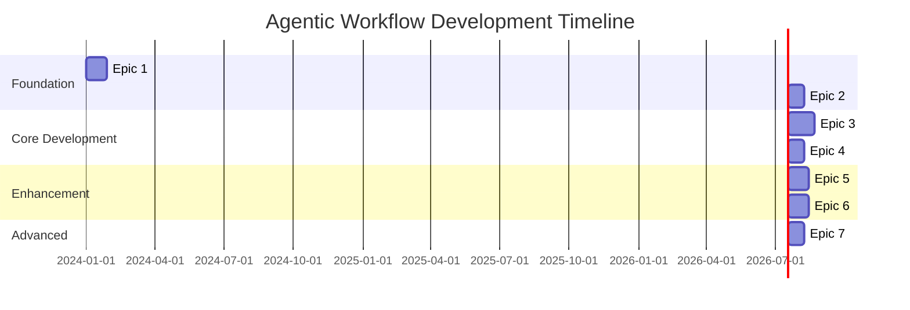

# Epics and Tasks Breakdown

## Overview

This document breaks down the agentic workflow system into manageable epics and tasks, providing a clear roadmap for development. Each epic represents a major functional area, with tasks that can be completed incrementally.

## Epic Structure

### 🏗️ Epic 1: Core Foundation Infrastructure
**Priority**: P0 (Highest)
**Estimated Duration**: 4 weeks
**Dependencies**: None

#### Tasks:
1. **Task 1.1: Python Development Environment Setup**
   - **Python Environment**:
     - Set up Python 3.11+ with pyenv for version management
     - Configure virtual environments with venv or conda
     - Install and configure pip and pip-tools for dependency management
     - Set up pyproject.toml for project configuration
   - **Project Structure**:
     - Create Python package structure with `src/agentic_workflow/`
     - Set up proper `__init__.py` files and module organization
     - Configure `requirements.txt` and `requirements-dev.txt`
     - Create `setup.py` or use `pyproject.toml` for installable package
   - **Code Quality Tools**:
     - Configure Black for code formatting
     - Set up Flake8 for linting with custom rules
     - Install and configure MyPy for type checking
     - Set up pre-commit hooks for automated quality checks
     - Configure isort for import sorting
   - **CI/CD Pipeline**:
     - Configure GitLab CI/CD with Python-specific stages
     - Set up automated testing with pytest
     - Configure code coverage reporting with coverage.py
     - Set up automated dependency vulnerability scanning
     - Configure Docker build for Python applications
   - **Development Tools**:
     - Set up pytest for testing framework
     - Configure pytest-cov for coverage reporting
     - Install pytest-asyncio for async testing
     - Set up pytest-mock for mocking
     - Configure development dependencies (jupyterlab, ipython)
   - **Documentation Setup**:
     - Configure Sphinx for API documentation
     - Set up MkDocs for project documentation
     - Configure docstring standards (Google or NumPy style)
     - Set up automated documentation generation
   - **Acceptance Criteria**:
     - Python 3.11+ environment with proper dependency management
     - All code quality tools configured and passing
     - CI/CD pipeline successfully running Python tests
     - Development environment ready for team collaboration
     - Documentation framework operational

2. **Task 1.2: Core System Architecture**
   - Implement basic component structure and interfaces
   - Set up service communication patterns
   - Create configuration management system
   - Establish logging and basic monitoring
   - **Acceptance Criteria**: Core architecture supports component interaction

3. **Task 1.3: Memory Management Foundation**
   - Implement short-term memory with context windows
   - Set up vector store (Weaviate) for long-term memory
   - Configure Redis for caching and sessions
   - Create memory operation interfaces
   - **Acceptance Criteria**: Memory system supports basic CRUD operations

4. **Task 1.4: Guardrails and Safety Systems**
   - Implement input validation and sanitization
   - Create resource limit enforcement
   - Set up error handling and recovery mechanisms
   - Establish safety check protocols
   - **Acceptance Criteria**: System prevents and handles errors gracefully

---

### 🧠 Epic 2: Graph-Based Core System
**Priority**: P0 (Highest)
**Estimated Duration**: 3 weeks
**Dependencies**: Epic 1

#### Tasks:
1. **Task 2.1: Knowledge Graph Implementation**
   - Set up Neo4j database for knowledge storage
   - Create graph schema for domain knowledge
   - Implement graph query and update operations
   - Build knowledge ingestion pipeline
   - **Acceptance Criteria**: Knowledge graph stores and retrieves domain information

2. **Task 2.2: Task Graph System**
   - Design task representation and relationships
   - Implement task dependency management
   - Create task execution planning algorithms
   - Build task status tracking system
   - **Acceptance Criteria**: Tasks can be planned, executed, and tracked

3. **Task 2.3: Skill Graph Integration**
   - Model agent capabilities and skills
   - Implement skill-task matching algorithms
   - Create skill learning and improvement tracking
   - Build skill recommendation system
   - **Acceptance Criteria**: System matches tasks to appropriate agent skills

4. **Task 2.4: Graph Processing Engine**
   - Implement graph query optimization
   - Create graph validation and consistency checks
   - Build graph analytics and insights
   - Set up graph backup and recovery
   - **Acceptance Criteria**: Graph operations are performant and reliable

---

### 🤖 Epic 3: Core Agent Implementation
**Priority**: P1 (High)
**Estimated Duration**: 5 weeks
**Dependencies**: Epic 1, Epic 2

#### Tasks:
1. **Task 3.1: Requirement Engineering Agent**
   - Implement stakeholder input gathering
   - Create requirement analysis and validation
   - Build requirement documentation generation
   - Set up requirement change management
   - **Acceptance Criteria**: Agent can gather and document project requirements

2. **Task 3.2: Code Generation Agent**
   - Integrate OpenAI API for code generation
   - Implement code template and pattern library
   - Create code quality validation
   - Build code documentation generation
   - **Acceptance Criteria**: Agent generates clean, documented code

3. **Task 3.3: Testing Agent**
   - Implement automated test generation
   - Create test execution and reporting
   - Build test coverage analysis
   - Set up test result management
   - **Acceptance Criteria**: Agent can create and execute comprehensive tests

4. **Task 3.4: CI/CD Agent**
   - Integrate with GitLab CI/CD pipelines
   - Implement deployment automation
   - Create environment management
   - Build rollback and recovery mechanisms
   - **Acceptance Criteria**: Agent manages full deployment lifecycle

5. **Task 3.5: Program Manager Agent**
   - Implement task coordination and routing
   - Create progress tracking and reporting
   - Build stakeholder communication
   - Set up performance optimization
   - **Acceptance Criteria**: Agent orchestrates workflow execution

---

### 🔧 Epic 4: Tool Integration and Orchestration
**Priority**: P1 (High)
**Estimated Duration**: 3 weeks
**Dependencies**: Epic 3

#### Tasks:
1. **Task 4.1: Project Management Tool Integration**
   - Integrate GitLab project management
   - Implement task synchronization
   - Create progress visualization
   - Build reporting automation
   - **Acceptance Criteria**: Seamless project management tool integration

2. **Task 4.2: Development Tool Integration**
   - Integrate code repositories and IDEs
   - Implement code review automation
   - Create development workflow tools
   - Build code quality measurement
   - **Acceptance Criteria**: Development tools work seamlessly with agents

3. **Task 4.3: Communication and Notification System**
   - Implement multi-channel notifications
   - Create stakeholder communication protocols
   - Build alert and escalation systems
   - Set up collaboration interfaces
   - **Acceptance Criteria**: Effective communication between all system components

4. **Task 4.4: Tool Agent Implementation**
   - Create dynamic tool discovery and integration
   - Implement tool capability assessment
   - Build tool execution management
   - Set up tool performance monitoring
   - **Acceptance Criteria**: System can integrate and manage external tools

---

### 📊 Epic 5: Monitoring, Analytics, and Optimization
**Priority**: P2 (Medium)
**Estimated Duration**: 4 weeks
**Dependencies**: Epic 3, Epic 4

#### Tasks:
1. **Task 5.1: Performance Monitoring System**
   - Implement Prometheus metrics collection
   - Create Grafana dashboards
   - Build performance alerting
   - Set up capacity planning
   - **Acceptance Criteria**: Comprehensive system performance visibility

2. **Task 5.2: Business Intelligence and KPIs**
   - Implement business metric tracking
   - Create KPI dashboards and reporting
   - Build trend analysis and forecasting
   - Set up ROI measurement
   - **Acceptance Criteria**: Clear visibility into business value delivered

3. **Task 5.3: System Analytics and Insights**
   - Implement ELK stack for log analysis
   - Create behavioral pattern detection
   - Build predictive analytics
   - Set up optimization recommendations
   - **Acceptance Criteria**: System provides actionable insights

4. **Task 5.4: Error Tracking and Resolution**
   - Integrate Sentry for error tracking
   - Implement automated error categorization
   - Create resolution workflow automation
   - Build error prevention mechanisms
   - **Acceptance Criteria**: Proactive error detection and resolution

---

### 🔄 Epic 6: Advanced Patterns and Learning
**Priority**: P2 (Medium)
**Estimated Duration**: 4 weeks
**Dependencies**: Epic 3

#### Tasks:
1. **Task 6.1: Reasoning Pattern Implementation**
   - Implement Chain of Thought reasoning
   - Create ReAct (Reasoning + Acting) pattern
   - Build RAISE (Reasoning, Acting, Interpreting, Self-Evaluating) pattern
   - Set up reasoning validation
   - **Acceptance Criteria**: Agents use sophisticated reasoning patterns

2. **Task 6.2: Learning and Improvement Systems**
   - Implement Self-Refinement mechanisms
   - Create Reflexion learning pattern
   - Build LATM (Learning at the Moment) capabilities
   - Set up knowledge retention and transfer
   - **Acceptance Criteria**: Agents continuously improve performance

3. **Task 6.3: Meta-Agent Architecture**
   - Implement agent coordination and delegation
   - Create dynamic agent composition
   - Build agent specialization management
   - Set up multi-agent collaboration
   - **Acceptance Criteria**: Agents work together effectively

4. **Task 6.4: Adaptive Workflow Management**
   - Implement dynamic workflow adaptation
   - Create context-aware task routing
   - Build workflow optimization algorithms
   - Set up performance-based improvements
   - **Acceptance Criteria**: System adapts workflows based on performance

---

### 🚀 Epic 7: Advanced Integration and Scaling
**Priority**: P3 (Lower)
**Estimated Duration**: 3 weeks
**Dependencies**: All previous epics

#### Tasks:
1. **Task 7.1: Document Agent Enhancement**
   - Implement advanced document processing
   - Create intelligent content analysis
   - Build document generation automation
   - Set up version control and collaboration
   - **Acceptance Criteria**: Sophisticated document management capabilities

2. **Task 7.2: External System Integration**
   - Implement API gateway for external access
   - Create webhook and event-driven integrations
   - Build third-party service connectors
   - Set up data synchronization
   - **Acceptance Criteria**: Seamless integration with external systems

3. **Task 7.3: Scalability and Performance Optimization**
   - Implement horizontal scaling capabilities
   - Create load balancing and distribution
   - Build performance optimization algorithms
   - Set up auto-scaling mechanisms
   - **Acceptance Criteria**: System scales efficiently under load

4. **Task 7.4: Security and Compliance**
   - Implement comprehensive security measures
   - Create audit trails and compliance reporting
   - Build access control and authentication
   - Set up data protection and privacy
   - **Acceptance Criteria**: System meets security and compliance requirements

---

## Epic Dependencies and Timeline

## Task Tracking Template

For each task, we'll track:
- **Status**: Not Started | In Progress | Review | Complete
- **Assigned Agent/Human**: Who's responsible
- **Dependencies**: What must be complete first
- **Acceptance Criteria**: Definition of done
- **Story Points**: Effort estimation
- **Documentation**: Links to relevant docs
- **Tests**: Required test coverage

## Next Steps

1. **Immediate**: Start with Epic 1, Task 1.1 (Python Development Environment Setup)
2. **Week 1**: Complete foundation setup tasks
3. **Week 2**: Begin graph-based core implementation
4. **Weekly Reviews**: Assess progress and adjust priorities
5. **Continuous**: Update documentation and learnings

This structure provides clear, actionable work items while maintaining flexibility for AI agent collaboration and iterative improvement.
